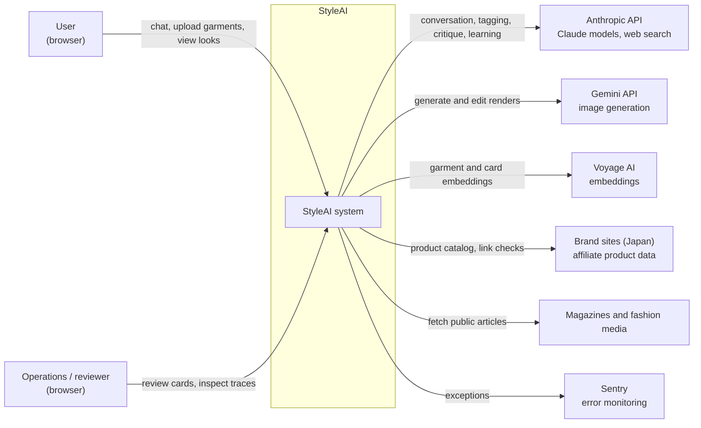
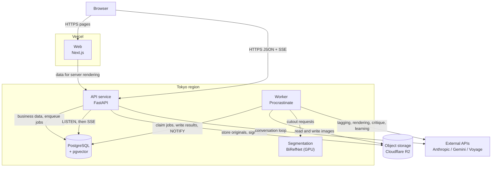
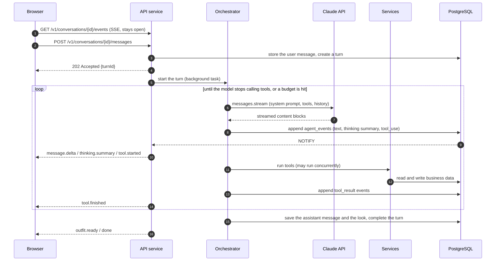
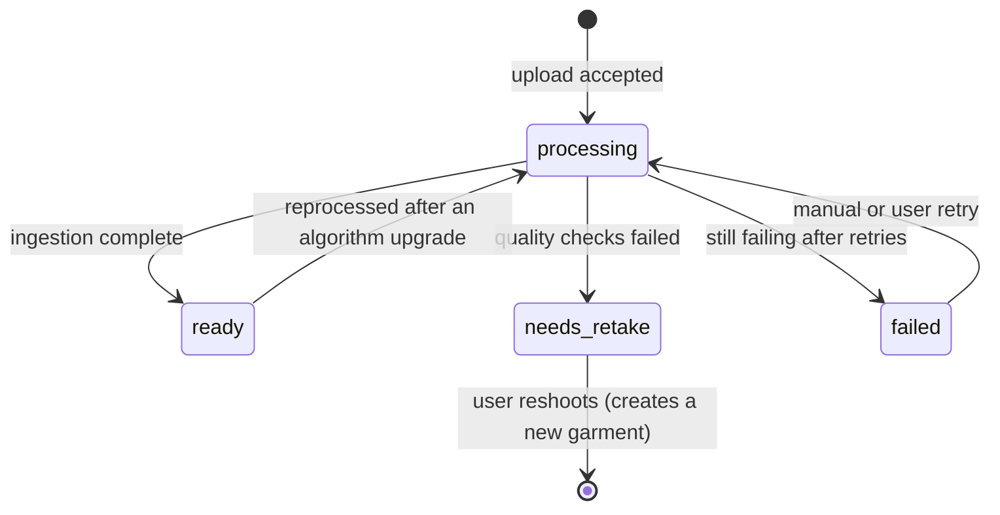
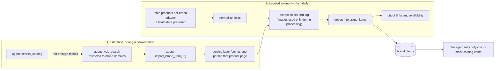
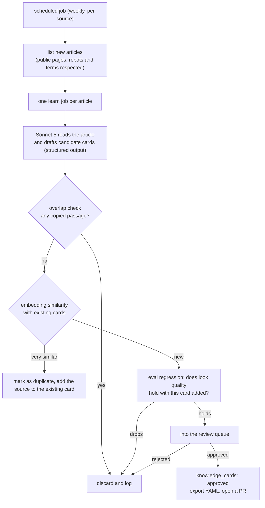
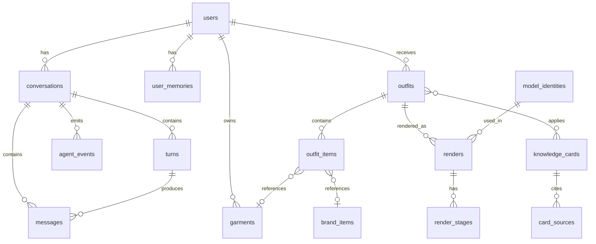

# System Architecture

> Language: [中文](../zh/05-system-architecture.md) · [日本語](../ja/05-system-architecture.md) · **English**
> Status: Draft v0.1 · Updated: 2026-09-16
> The Chinese version is the source of truth. If versions differ, the Chinese version wins.
> This document describes the structure of the first StyleAI v2 release: what it is made of, how the parts work together, how data flows, and what happens when things fail. For the reasoning behind the technology choices, see [Tech stack](02-tech-stack.md); for how the underlying techniques work, see the [tech notes](https://github.com/ailuruschen-bit/stylist-agent/tree/tech-notes/docs/zh/tech-notes) on the `tech-notes` branch (Chinese).

## 1. Architecture goals

The design serves the product goals in the charter, under these constraints:

| Goal | How the architecture reflects it |
| --- | --- |
| Conversation never leaves the user waiting | Output streams as it is produced; slow work such as rendering goes to a job queue instead of blocking the conversation |
| Renders stay faithful to the user's clothes | Ingestion stores the segmentation cutout as the truth image; renders are checked against it |
| Every look has reasoning, and every problem is traceable | Looks cite technique cards; every agent step and tool call is recorded in a trace |
| Models can be replaced | LLMs, image, segmentation and embedding models all sit behind provider interfaces |
| Cost stays under control | Token and render-count limits per turn and per look, with degradation when they are hit |
| Compliance | Only metadata and our own abstractions of external content are stored; all external web content is treated as untrusted data |
| Infrastructure stays simple | The first release depends only on PostgreSQL and object storage: no Redis, no message broker |

Constraints: web only; the launch market is Japan and the service runs in the Tokyo region; the team is small, so managed services are preferred to reduce operational work.

## 2. System context

How StyleAI relates to external systems:



| External system | What we send | What we receive | Sensitivity |
| --- | --- | --- | --- |
| Anthropic API | Conversation history, garment images and tags, tool results | Model output, search results | Includes user uploads; handled under the API terms |
| Gemini API | Model reference images, garment truth images, render prompts | Generated images | Includes user uploads |
| Voyage AI | Garment images, tag text, card text | Embeddings | Includes user uploads |
| Brand sites, affiliate channels | Product queries | Product metadata, links | No user data is sent |
| Magazine sites | Requests for public articles | Article content (used during processing only, never stored) | No user data is sent |

User uploads are sent to third-party model services. The privacy policy must say so, and the data terms of each service (training use, retention) must be confirmed before launch.

## 3. Container view

A "container" here is anything that can be deployed and run on its own:



| Container | Responsibility | Scaling |
| --- | --- | --- |
| Web | Pages, interaction, consuming SSE events | Vercel autoscaling |
| API service | Auth, REST endpoints, the conversation loop (agent orchestrator), SSE, enqueueing jobs | Stateless; scales horizontally |
| Worker | Jobs: wardrobe ingestion, multi-stage rendering, brand sweeps, magazine learning, stalled-job recovery | Scales per queue; the render queue runs on its own workers |
| Segmentation | Image in, alpha matte out | GPU instances; deployment form decided in M1 |
| PostgreSQL | Business data, job queue, events, vector search | Managed service; vertical scaling plus read replicas if needed |
| Object storage | Originals, truth images, renders, stage outputs | Managed service |

The conversation loop runs in the API service rather than in a worker: one turn usually finishes in tens of seconds and its output must stream to the browser, so the process handling the request drives it directly. Anything slower than that (rendering, ingestion) goes to the job queue.

## 4. Backend modules

The API service and the worker share one codebase in `apps/api`, split by responsibility:

```text
app/
├── api/              HTTP routers, request/response schemas, SSE endpoint
├── agent/
│   ├── orchestrator  the conversation loop (one turn = several model calls)
│   ├── tools/        one module per agent tool; tools call services only
│   ├── prompts/      system prompts as versioned markdown files
│   └── budget        per-turn token and render limits
├── services/
│   ├── auth          sessions, users
│   ├── wardrobe      garments, tags, similarity search
│   ├── catalog       brand items, link checks
│   ├── outfits       looks, rule validation
│   ├── renders       render jobs, stages, critique results
│   ├── knowledge     technique cards, review workflow
│   ├── models        model identities (the built-in model roster)
│   ├── memory        user preferences and dislikes
│   ├── events        conversation and job events for SSE
│   └── credits       usage accounting
├── pipelines/
│   ├── ingest        segmentation -> QA -> colors -> tagging -> embeddings
│   ├── render        plan -> stages -> critique -> repair
│   ├── scout         brand catalog sweeps
│   └── learn         magazine reading -> candidate cards
├── providers/
│   ├── llm           Anthropic
│   ├── image         Gemini image models
│   ├── segmentation  BiRefNet service client
│   ├── embedding     Voyage
│   └── storage       R2 / local filesystem
├── repositories/     database access, one module per aggregate
└── worker/           Procrastinate app and task definitions
```

Dependencies only point downward; nothing points back up or skips a layer:

```text
api ─────────┐
agent/tools ─┼──► services ──► repositories ──► PostgreSQL
worker ──────┘        │
   │                  └──────► providers ──► external APIs / object storage
   └──► pipelines ──► services / providers
```

- `agent/tools` and `pipelines` never reach `repositories` directly: business rules live in `services` in one place.
- `providers` depend on no business module; they only call external services, retry, and record usage.
- `services` may call each other but must not form cycles; when a cycle appears, the shared part becomes a new service.

## 5. Core flows

### 5.1 One conversation turn

A turn starts when the user sends a message and ends with the agent's reply. The browser uses two endpoints: one to send the message, one to subscribe to the event stream.



Key design points:

- **Sending and subscribing are separate.** `POST messages` returns `202` immediately; the actual output arrives on the event stream. Reloading the page or losing the network does not lose the turn in progress.
- **Events are stored first, then pushed.** Every event is written to `agent_events` (with a per-conversation increasing `seq`) and then announced with `NOTIFY`. On reconnect the browser sends `Last-Event-ID` and the API replays what it missed from the database. With several API instances, any instance can replay and push.
- **One turn at a time per conversation.** A message sent while a turn is running queues behind it and starts when that turn finishes.
- **If the process running the orchestrator dies**, the turn stays `running`. A recovery job marks timed-out turns as `interrupted` and pushes a retryable error event. Messages and tool results already stored are unaffected.

### 5.2 Wardrobe ingestion

```mermaid
sequenceDiagram
    autonumber
    participant B as Browser
    participant A as API service
    participant R2 as Object storage
    participant DB as PostgreSQL
    participant W as Worker
    participant SEG as Segmentation
    participant C as Claude API
    participant V as Voyage

    B->>A: POST /v1/garments (image)
    A->>A: validate format, size, dimensions
    A->>R2: store the original
    A->>DB: one transaction: insert garment (processing) + enqueue ingest job
    A-->>B: 202 {garmentId}
    W->>DB: claim the ingest job
    W->>R2: read the original
    W->>W: fix orientation, normalize size and color space
    W->>SEG: cut out
    SEG-->>W: alpha matte
    W->>W: quality checks
    alt checks fail
        W->>DB: garment -> needs_retake, store the reason and an event
    else checks pass
        W->>R2: store the truth image (PNG with alpha)
        W->>W: extract colors
        W->>C: vision tagging (structured output)
        W->>V: embeddings for the image and the tag text
        W->>DB: store tags, colors, embeddings; garment -> ready; write an event
    end
```

**Garment states:**



**Quality checks** (thresholds are initial values, calibrated with real photos in M1):

| Check | How | What the user is told |
| --- | --- | --- |
| Foreground area | Foreground covers 5%–90% of the frame | The garment is too small, or shot too close |
| Cropping | Share of the image border the foreground touches | The garment is not fully in frame |
| Number of subjects | Connected foreground regions larger than 20% of the biggest one | There is more than one garment in the photo |
| Sharpness | Laplacian variance over the foreground | The photo is blurry |
| Segmentation confidence | Share of alpha values between 0.2 and 0.8 | The background is busy; try a plain one |

**Tagging output** is constrained by a fixed schema through structured outputs, and every field carries the model's confidence. Fields below the threshold are re-checked by Sonnet 5; fields that stay uncertain are shown as "needs confirmation" for the user to resolve.

**Job design:** the ingest job uses `queueing_lock = garment:{id}` to prevent duplicate enqueues. Intermediate artifacts (normalized image, alpha, cutout) are keyed by garment id, so a retry reuses whatever already exists.

### 5.3 Multi-stage rendering

When the agent calls `render_look`, the service layer creates a `renders` row and enqueues the render job (queue `render`, `lock = outfit:{id}`) in one transaction, then returns the job id immediately.

**Render job states:**

```mermaid
stateDiagram-v2
    [*] --> queued
    queued --> planning: worker claims it
    planning --> rendering: render plan ready
    rendering --> critiquing: all stages done
    critiquing --> succeeded: checks pass
    critiquing --> repairing: issues found, repair budget left
    repairing --> critiquing: repaired stage done
    critiquing --> succeeded_with_issues: repair budget spent; keep the best result and flag it
    planning --> failed
    rendering --> failed: still failing after retries
    repairing --> failed
    succeeded --> [*]
    succeeded_with_issues --> [*]
    failed --> [*]
```



**Planning.** The worker hands Claude Opus 5 the look (pieces, layer roles, wear styles), each piece's truth image and tags, and the chosen model's reference set, and asks for a structured render plan:

```json
{
  "complexity": "multi_stage",
  "stages": [
    {
      "no": 1,
      "goal": "Base look: model wearing the white tee and indigo straight jeans",
      "inputs": ["model:M-004/front", "garment:G-000102", "garment:G-000131"],
      "must_keep": ["jeans indigo wash and fading", "tee neckline shape"],
      "prompt": "..."
    },
    {
      "no": 2,
      "goal": "Tie the grey hoodie around the waist, sleeves knotted at the front",
      "inputs": ["stage:1", "garment:G-000127"],
      "must_keep": ["heather grey texture", "navy chest logo visible on the hanging body"],
      "prompt": "..."
    }
  ],
  "checks": [
    "hoodie is tied at the waist, not worn",
    "jeans color matches G-000102 within tolerance",
    "full body in frame, 3:4"
  ]
}
```

The agent writes each `prompt` from the look itself. There is no fixed render prompt template in the code.

**Stage by stage.** Each stage calls the image provider: stage 1 uses `generate` (model reference plus garment references), later stages use `edit` (the previous output plus the new garment references). After each stage:

1. the image is stored in object storage;
2. `render_stages` records inputs, prompt, model, latency and cost;
3. a `render.stage` event is written so the browser can show the stage image as it lands.

**Critique and repair.** Once all stages are done, Claude Opus 5 checks the final image against the plan's `checks` and each piece's truth image and returns a structured result:

```json
{
  "pass": false,
  "issues": [
    { "stage": 2, "type": "wear_not_executed", "detail": "The hoodie is worn over the tee instead of tied at the waist." }
  ]
}
```

On failure, `issues` point at a stage: that stage and the ones after it are re-run, or the final image is edited locally. The repair budget starts at 2 attempts.

**Resuming.** When a crashed job is re-run, the worker reads the successful stages from `render_stages` and continues from the first incomplete one instead of regenerating finished images.

**Budget.** A render job may make at most 8 image calls including repairs. When the budget runs out, repairs stop, the result with the fewest issues is kept, the status becomes `succeeded_with_issues`, and the look card says so.

### 5.4 Brand catalog

Brand products reach the catalog two ways:



- **Brand adapters**: one module per brand, fetching products from that brand's data source and mapping them to the shared fields. Source selection follows section 2.1 of Content sources.
- **The citation rule is enforced in the service layer**: `save_outfit` verifies every brand item exists in `brand_items` and is in stock, and returns an error to the agent otherwise. Prompts alone are not the control.
- **External pages are untrusted data**: text on a product page may be addressed at the model. Only parsed, structured fields reach the agent; page text never enters the system prompt.

### 5.5 Magazine learning



- Article text lives only in memory during the job, for extraction and the overlap check; nothing is stored afterwards.
- Initial overlap rule: any card field sharing a passage longer than 30 characters with the article counts as copying.
- The review screen shows the candidate card, the source link, eval results, and similar existing cards; a reviewer can edit before approving.

## 6. Data model

### 6.1 Entities



### 6.2 Main tables

Every table uses a UUID primary key (technique cards excepted) and timezone-aware `created_at` and `updated_at`. Only the key fields are listed.

| Table | Key fields | Notes |
| --- | --- | --- |
| `users` | email, password_hash, display_name, locale, role | locale is zh-CN / ja / en |
| `user_memories` | user_id, kind (like / dislike / occasion / note), content, source_turn_id | Written by agent tools; users can view and delete |
| `conversations` | user_id, title, status | |
| `turns` | conversation_id, status (queued / running / completed / interrupted / failed), usage, cost_usd | Execution record and cost of one turn |
| `messages` | conversation_id, turn_id, role, content (JSONB) | Content blocks stored exactly as the API returns them, for the next request |
| `agent_events` | conversation_id, seq, turn_id, type, payload | Primary key (conversation_id, seq); the source for SSE replay |
| `garments` | user_id, status, original_key, cutout_key, category, colors, attributes, alt_wears, tag_confidence, method_versions, image_embedding, text_embedding | The shape of `colors` is described in the color extraction tech note |
| `brand_items` | brand, external_id, url, title, category, colors, attributes, price_jpy, availability, line (staple / new), source, fetched_at, last_checked_at, embedding | Unique on (brand, external_id) |
| `outfits` | user_id, turn_id, occasion, palette_logic, reasoning, status | |
| `outfit_items` | outfit_id, garment_id or brand_item_id, layer_role, wear_style, position | Check constraint: exactly one of the two foreign keys is set; wear_style is normal / tied_waist / one_sleeve_off, … |
| `outfit_cards` | outfit_id, card_id | Technique cards the look cites |
| `renders` | outfit_id, model_identity_id, status, plan, final_key, image_calls, cost_usd, issues | |
| `render_stages` | render_id, stage_no, attempt, goal, prompt, input_keys, output_key, provider, model, latency_ms, cost_usd, critique | Unique on (render_id, stage_no, attempt) |
| `knowledge_cards` | id (K-0001), status, title, terms, when_to_use, how, avoid, tags, season_scope, expires_at, confidence, embedding, origin (human / pipeline), reviewed_by | |
| `card_sources` | card_id, outlet, title, url, accessed_at | |
| `content_sources` | outlet, type, priority, base_url, enabled, last_crawled_at | Mirrors Content sources |
| `model_identities` | code (M-004), display_name, presentation, archetype, reference_keys, generator, generated_at, license, similarity_check, active | |
| `usage_events` | user_id, kind, amount, ref_id | Credit ledger, carried over from the demo |
| `procrastinate_*` | Managed by Procrastinate | Created by its own migrations |

Embedding columns use pgvector's `vector` type; the dimension follows the chosen embedding model, with HNSW indexes where the query pattern needs them.

## 7. Agent design

### 7.1 What goes into the context

Every request to Claude is ordered "most stable first", so the prompt cache can cover as much as possible:

| Order | Content | Changes | Cached |
| --- | --- | --- | --- |
| 1 | Tool definitions | Per release | Yes |
| 2 | System prompt: persona, styling principles, output requirements | Per release | Yes |
| 3 | Technique card index (titles and tags, no bodies) | When the knowledge base changes | Yes |
| 4 | User memory summary, wardrobe overview (counts by category) | May change every turn | No |
| 5 | Conversation history | Appended each turn | The earlier prefix is |
| 6 | This turn's user message | Every turn | — |

Card bodies never sit in the context; the agent fetches what it needs with `retrieve_techniques`. For long conversations, server-side compaction summarizes earlier history. Facts (wardrobe, looks, catalog) live in the database, so they can always be re-queried with a tool.

### 7.2 Tools

| Tool | Purpose | Writes data | Latency |
| --- | --- | --- | --- |
| `search_wardrobe` | Search the user's wardrobe by category, color, style, similarity | No | Short |
| `get_garment` | Full tags and colors of one garment | No | Short |
| `retrieve_techniques` | Fetch technique card bodies for a situation | No | Short |
| `search_catalog` | Search the brand catalog | No | Short |
| `web_search` (server tool) | Search restricted to brand domains | No | Medium |
| `import_brand_item` | Parse a found product page into the catalog | Yes (catalog) | Medium |
| `validate_outfit` | Check a candidate look against color and layering rules | No | Short |
| `save_outfit` | Save a look; verifies pieces exist and brand items are in stock | Yes | Short |
| `render_look` | Create a render job and return its id immediately | Yes (enqueues) | Short |
| `get_render_status` | Progress and critique result of a render job | No | Short |
| `list_models` | Available models and their style archetypes | No | Short |
| `remember_preference` | Record a preference or dislike the user stated | Yes (memory) | Short |

Every writing tool is idempotent: calling it twice with the same arguments within a turn does not create duplicates.

### 7.3 Budgets and degradation

The orchestrator checks these limits on every turn (initial values, tuned after M0):

| Limit | Initial value | When hit |
| --- | --- | --- |
| Model calls per turn | 12 | Ask the agent to answer from what it already has |
| Output tokens per turn | 32K | Same |
| New render jobs per turn | 2 | `render_look` returns an error saying the limit is reached |
| Image calls per render job | 8 | See section 5.3 |

Hitting a limit is recorded in the trace, so it is possible to tell a prompt problem from a genuinely complex request.

## 8. Realtime events

One SSE connection carries every event of a conversation, including progress of render jobs started in it:

```text
GET /v1/conversations/{id}/events
Last-Event-ID: 128          ← sent automatically by the browser on reconnect

id: 129
event: render.stage
data: {"seq":129,"renderId":"...","stageNo":2,"imageUrl":"..."}
```

- **Where events come from**: both the orchestrator in the API and the pipelines in the worker write through `services.events`, committing events in the same transaction as the business data and issuing `NOTIFY` on commit.
- **Delivery**: each API instance `LISTEN`s for the conversations whose SSE connections it holds, then reads events with a `seq` above what it has sent and pushes them.
- **Replay**: on connect, events after `Last-Event-ID` are replayed from the database. A lost notification never loses an event; it is delivered on the next notification or by the 5-second fallback poll.
- **Keep-alive**: an SSE comment every 15 seconds, so proxies and load balancers do not drop an idle connection.

Event types are defined in section 8 of the development guidelines.

## 9. API overview

| Method | Path | Purpose |
| --- | --- | --- |
| POST | `/v1/auth/login`, `/v1/auth/logout` | Sign in and out |
| GET | `/v1/me` | Current user and credits |
| GET, POST | `/v1/conversations` | List and create conversations |
| POST | `/v1/conversations/{id}/messages` | Send a message; returns 202 and a turnId |
| GET | `/v1/conversations/{id}/events` | SSE event stream |
| GET | `/v1/conversations/{id}/messages` | Message history (paginated) |
| POST | `/v1/garments` | Upload a garment; returns 202 and a garmentId |
| GET | `/v1/garments`, `/v1/garments/{id}` | Wardrobe list and detail |
| PATCH | `/v1/garments/{id}` | User corrections to tags |
| DELETE | `/v1/garments/{id}` | Delete a garment and its images |
| GET | `/v1/outfits`, `/v1/outfits/{id}` | Look list and detail |
| POST | `/v1/outfits/{id}/renders` | Re-render a look |
| GET | `/v1/renders/{id}` | Render job detail and stage images |
| GET, DELETE | `/v1/me/memories` | View and delete what the agent remembered |
| GET | `/v1/models` | Model roster |
| GET, POST | `/v1/admin/cards/review` | Candidate card review (admin) |
| GET | `/v1/admin/traces/{turnId}` | Agent trace (admin) |

Request and response shapes, the error format and pagination rules are in section 8 of the development guidelines.

## 10. File storage

Object storage is organized by prefix, and every object is private by default:

```text
users/{userId}/garments/{garmentId}/original.jpg
users/{userId}/garments/{garmentId}/normalized.jpg
users/{userId}/garments/{garmentId}/alpha.png
users/{userId}/garments/{garmentId}/cutout.png
users/{userId}/renders/{renderId}/stage-{no}-{attempt}.png
users/{userId}/renders/{renderId}/final.png
models/{modelCode}/{view}.png
```

- The browser reads images through short-lived signed URLs (10 minutes) issued by the API.
- Deleting a garment or an account deletes every object under the matching prefix. Intermediate render images are removed 30 days after the job finishes; final images are kept.
- Brand product images are never written to object storage (see section 2.1 of Content sources).

## 11. Security and privacy

| Area | Measure |
| --- | --- |
| Authentication | httpOnly, Secure, SameSite=Lax session cookie; revocable server-side |
| CSRF | Mutating endpoints check the origin and require a custom header |
| Data isolation | Every query is filtered by `user_id` in the repository layer; admin endpoints have separate authorization |
| Uploads | Real file type and dimensions are validated, images are re-encoded, and EXIF location data is stripped |
| External content | Web pages, search results and articles are untrusted data: only structured fields are extracted, and never placed in the system prompt |
| Agent permissions | The agent can only call the tools in section 7.2, and tools only reach the current user's data |
| Secrets | Only in the deployment platform's secret store; filtered out of logs |
| Rate limits | Per-user limits on messages, uploads and renders |
| Deletion | Users can delete garments, looks, memories and their account; deletion cascades to object storage |

## 12. Observability

- **Request tracing**: each HTTP request gets a `trace_id`, which is written into job arguments, carried by the worker, and attached to every external API call.
- **Agent trace**: `turns`, `agent_events` and `render_stages` together form the full record of a turn. An admin page shows each model call's input summary, output, tool arguments and results, tokens, latency and cost on a timeline.
- **Metrics**:

| Metric | Why |
| --- | --- |
| Latency to the first `message.delta` | Conversation experience |
| Model calls, tokens and cost per turn | Cost and prompt quality |
| Ingestion step latency and `needs_retake` rate | Segmentation quality and shooting guidance |
| Render stage latency, repair count, `succeeded_with_issues` rate | Render quality |
| Queue backlog and wait time | Worker capacity |
| External API error and rate-limit counts | Provider stability |

- **Alerts**: sustained external API errors, queue backlog above a threshold, rising render failure rate.

## 13. Failure handling

| Failure | System behavior | What the user sees |
| --- | --- | --- |
| Claude API rate limit or outage | The SDK retries; if it still fails, the turn is `failed` | A retryable error |
| Model refuses to answer | Server-side fallback switches models; if still refused, the turn ends | An explanation that the request cannot be handled |
| Tool execution error | Returned to the model with `is_error` so it can adapt | Usually nothing |
| API process dies mid-turn | The turn is marked `interrupted` | A retryable error |
| Segmentation service unavailable | The ingest job is retried with backoff | The garment stays "processing" |
| Render API failure | The stage is retried; beyond the limit the job is `failed` | "Render failed, you can retry"; no credits charged |
| Worker crash | A scheduled job returns stalled jobs to the queue; rendering resumes from the first incomplete stage | Progress pauses, then continues |
| Brand item goes out of stock | The sweep updates its status; saved looks mark it | The item shows as unavailable, with a link to alternatives |
| Database unavailable | The API returns 503; workers stop claiming jobs | Service temporarily unavailable |

## 14. Deployment

| Environment | Purpose | Data |
| --- | --- | --- |
| local | Development | PostgreSQL in Docker, local filesystem storage, development API keys |
| staging | Integration and evals | Separate database and bucket, test accounts |
| production | Live service | Tokyo region |

- **Releases**: merging to `main` runs lint, type checks and tests in CI; on success it deploys to staging, and production follows after manual confirmation.
- **Migrations**: Alembic runs before the new code is deployed, so a migration must be compatible with the previous version of the code that is still running.
- **Worker releases**: stop claiming new jobs, wait for running jobs to finish or time out, then replace the process. Anything unfinished is picked up by stalled-job recovery.

## 15. Related documents

- [Project charter](01-project-charter.md)
- [Tech stack](02-tech-stack.md)
- [Development guidelines](03-dev-guidelines.md)
- [Content sources](04-content-sources.md)
- [Tech notes (`tech-notes` branch, Chinese)](https://github.com/ailuruschen-bit/stylist-agent/tree/tech-notes/docs/zh/tech-notes)
