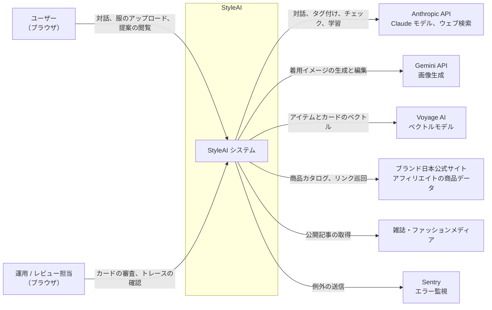
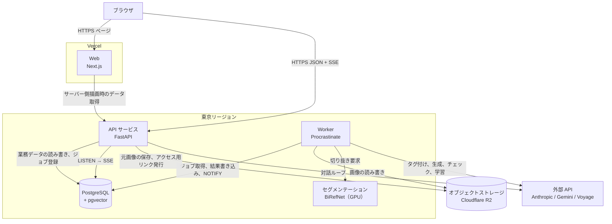
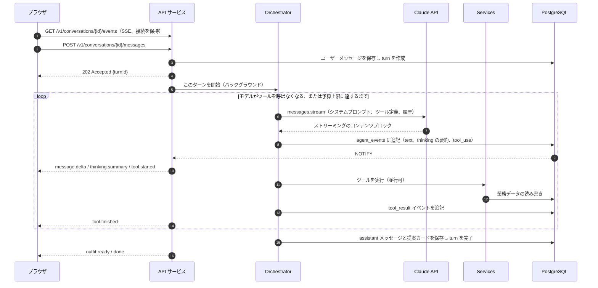
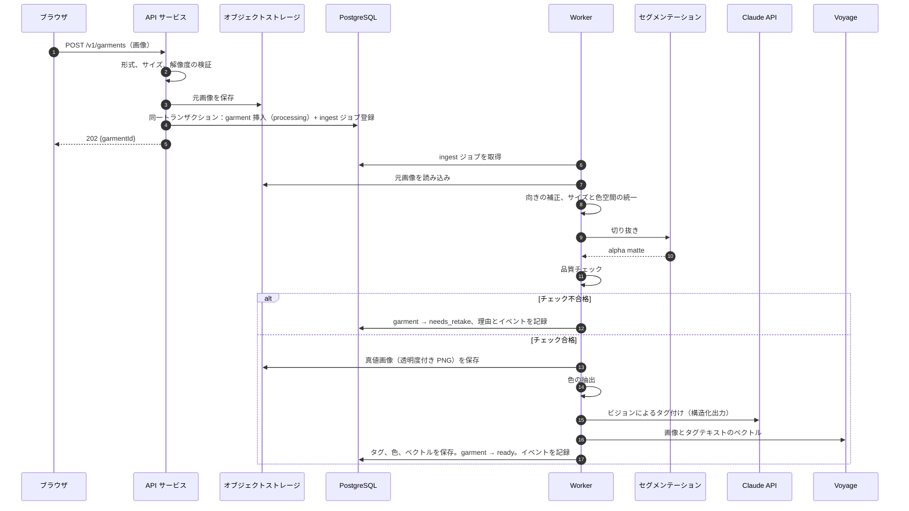
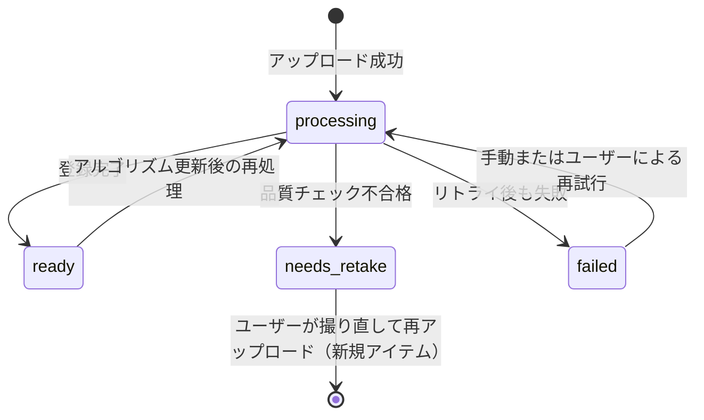
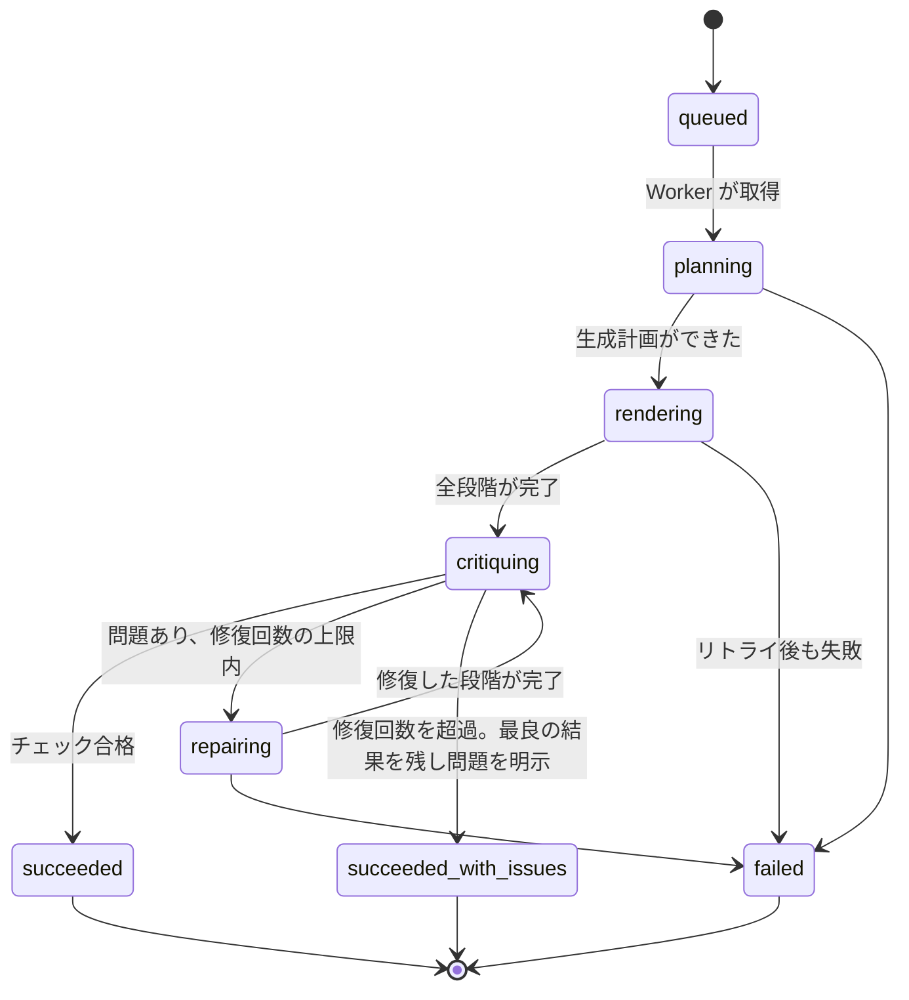
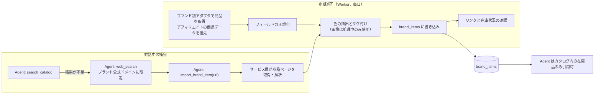
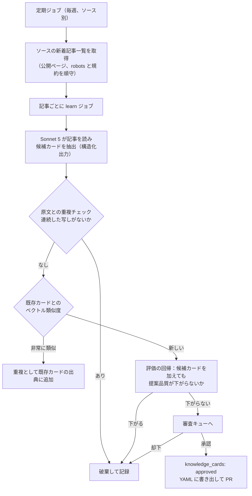
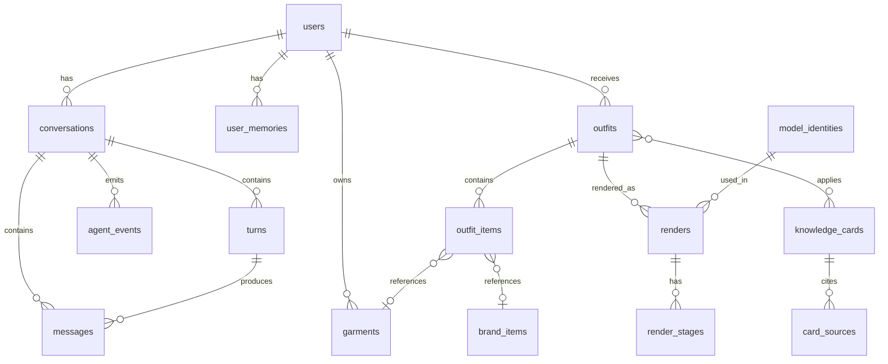

# システムアーキテクチャ

> 言語：[中文](../zh/05-system-architecture.md) · **日本語** · [English](../en/05-system-architecture.md)
> ステータス：ドラフト v0.1 · 更新：2026-09-16
> 中国語版が原本です。内容に差異がある場合は中国語版を優先します。
> 本書は StyleAI v2 初回リリースのシステム構成をまとめます：どの部分で構成され、どう連携し、データがどう流れ、障害時にどう振る舞うか。技術選定の理由は[「技術選定」](02-tech-stack.md)を、個々の技術の仕組みは `tech-notes` ブランチの[技術解説](https://github.com/ailuruschen-bit/stylist-agent/tree/tech-notes/docs/zh/tech-notes)（中国語）を参照してください。

## 1. アーキテクチャの目標

設計は企画書の製品目標に従い、次の制約のもとで行います。

| 目標 | アーキテクチャ上の反映 |
| --- | --- |
| 対話が滞らない | 対話の出力はストリーミングで配信。画像生成などの重い処理はジョブキューに入れ、対話をブロックしない |
| 着用イメージがユーザーの服に忠実 | 登録時にセグメンテーションで得た真値画像を保存し、生成後に真値画像と比較して確認 |
| 提案に理由があり、問題は追跡できる | 提案はテクニックカードを引用。Agent の推論とツール呼び出しをすべてトレースに記録 |
| モデルを差し替えられる | LLM、画像生成、セグメンテーション、ベクトルモデルはすべて provider インターフェース経由 |
| コストを管理できる | 対話 1 ターン、提案 1 件ごとにトークンと画像生成回数の上限。超過時は縮退 |
| コンプライアンス | 外部コンテンツはメタデータと自分でまとめた内容のみ保存。外部のウェブ内容はすべて信頼できないデータとして扱う |
| インフラを単純に保つ | 初回リリースは PostgreSQL とオブジェクトストレージのみに依存。Redis やメッセージ基盤は入れない |

制約：Web のみ。最初の市場は日本で、サービスは東京リージョンに配置。チームが小さいため、運用の手間を減らせるマネージドサービスを優先します。

## 2. システムコンテキスト

StyleAI と外部システムの関係：



| 外部システム | 送るもの | 受け取るもの | 機微度 |
| --- | --- | --- | --- |
| Anthropic API | 対話履歴、服の画像とタグ、ツール結果 | モデル出力、検索結果 | ユーザーのアップロード画像を含む。API の規約に従って扱う |
| Gemini API | モデル参照画像、服の真値画像、生成プロンプト | 生成画像 | ユーザーのアップロード画像を含む |
| Voyage AI | 服の画像、タグのテキスト、カードのテキスト | ベクトル | ユーザーのアップロード画像を含む |
| ブランド公式・アフィリエイト | 商品照会リクエスト | 商品メタデータ、リンク | ユーザーデータは送らない |
| 雑誌サイト | 公開記事のリクエスト | 記事本文（処理中のみ使用し、保存しない） | ユーザーデータは送らない |

ユーザーのアップロード画像は第三者のモデルサービスに送信されます。プライバシーポリシーで明記し、公開前に各サービスのデータ利用条件（学習利用の有無、保存期間）を確認します。

## 3. コンテナ構成

「コンテナ」は独立してデプロイ・実行できる単位を指します。



| コンテナ | 役割 | スケール方法 |
| --- | --- | --- |
| Web | 画面描画、操作、SSE イベントの受信 | Vercel が自動スケール |
| API サービス | 認証、REST API、対話ループ（Agent Orchestrator）、SSE 配信、ジョブ登録 | ステートレス。水平スケール |
| Worker | ジョブ実行：クローゼット登録、多段階生成、ブランド巡回、雑誌学習、停滞ジョブ回収 | キュー単位で水平スケール。生成キューは別デプロイ |
| セグメンテーション | 画像を入力し alpha matte を返す | GPU インスタンス。形態は M1 で決定 |
| PostgreSQL | 業務データ、ジョブキュー、イベント、ベクトル検索 | マネージドサービス。垂直スケール + 必要に応じてリードレプリカ |
| オブジェクトストレージ | 元画像、真値画像、着用イメージ、各段階の中間画像 | マネージドサービス |

対話ループは Worker ではなく API サービスに置きます。1 ターンは通常十数秒で完了し、モデルの出力をリアルタイムでブラウザに送る必要があるため、リクエストを処理するプロセスが直接駆動するのが最も単純です。これより長い処理（生成、登録）はすべてジョブキューに入れます。

## 4. バックエンドのモジュール構成

API サービスと Worker は `apps/api` の同じコードを共有し、役割ごとに次のパッケージに分かれます。

```text
app/
├── api/              HTTP routers, request/response schemas, SSE endpoint
├── agent/
│   ├── orchestrator  the conversation loop (one turn = several model calls)
│   ├── tools/        one module per agent tool; tools call services only
│   ├── prompts/      system prompts as versioned markdown files
│   └── budget        per-turn token and render limits
├── services/
│   ├── auth          sessions, users
│   ├── wardrobe      garments, tags, similarity search
│   ├── catalog       brand items, link checks
│   ├── outfits       looks, rule validation
│   ├── renders       render jobs, stages, critique results
│   ├── knowledge     technique cards, review workflow
│   ├── models        model identities (the built-in model roster)
│   ├── memory        user preferences and dislikes
│   ├── events        conversation and job events for SSE
│   └── credits       usage accounting
├── pipelines/
│   ├── ingest        segmentation -> QA -> colors -> tagging -> embeddings
│   ├── render        plan -> stages -> critique -> repair
│   ├── scout         brand catalog sweeps
│   └── learn         magazine reading -> candidate cards
├── providers/
│   ├── llm           Anthropic
│   ├── image         Gemini image models
│   ├── segmentation  BiRefNet service client
│   ├── embedding     Voyage
│   └── storage       R2 / local filesystem
├── repositories/     database access, one module per aggregate
└── worker/           Procrastinate app and task definitions
```

依存の向きは上から下だけで、逆方向や層を飛び越える依存は認めません。

```text
api ─────────┐
agent/tools ─┼──► services ──► repositories ──► PostgreSQL
worker ──────┘        │
   │                  └──────► providers ──► 外部 API / オブジェクトストレージ
   └──► pipelines ──► services / providers
```

- `agent/tools` と `pipelines` は `repositories` に直接アクセスせず、業務ルールは `services` の一箇所だけに置きます。
- `providers` は業務モジュールに依存せず、外部サービスの呼び出し、リトライ、計測だけを行います。
- `services` 同士の呼び出しは可能ですが循環させません。循環が生じたら共通部分を新しいサービスに切り出します。

## 5. 主要フロー

### 5.1 対話 1 ターン

1 ターンはユーザーのメッセージ送信で始まり、Agent の返答で終わります。ブラウザは 2 つの API を使います：メッセージを送る API と、イベントストリームを購読する API です。



設計上のポイント：

- **送信と購読を分ける。** `POST messages` はすぐに `202` を返し、実際の出力はイベントストリームで届きます。ページを再読み込みしても、進行中のターンを取りこぼしません。
- **イベントは先に保存し、それから配信する。** すべてのイベントをまず `agent_events` テーブルに書き（会話ごとに `seq` が増加）、`NOTIFY` で API インスタンスに通知して配信します。再接続時はブラウザが `Last-Event-ID` を送り、API がデータベースから欠けたイベントを補います。API が複数インスタンスでも、どのインスタンスでも補完と配信ができます。
- **同じ会話で同時に実行されるターンは 1 つだけ。** 前のターンが終わる前に送られたメッセージは後ろに並び、終了後に自動で開始します。
- **Orchestrator のプロセスが落ちた場合**、turn は `running` のまま残ります。回収ジョブがタイムアウトした turn を `interrupted` にし、再試行できるエラーイベントをユーザーに送ります。保存済みのメッセージとツール結果は影響を受けません。

### 5.2 クローゼット登録



**アイテムの状態：**



**品質チェック**（しきい値は初期値。M1 に実写で調整）：

| 項目 | 判定方法 | 不合格時の案内 |
| --- | --- | --- |
| 被写体の面積 | 前景ピクセルが画面の 5%〜90% | 服が小さすぎる、または寄りすぎ |
| 見切れ | 前景が画像の端に接する長さの比率 | 服が全部写っていない |
| 被写体の数 | 前景の連結領域のうち、最大領域の 20% を超えるものの数 | 画面に複数の服がある |
| 鮮明さ | 前景領域のラプラシアン分散 | 写真がぼやけている |
| 分割の確信度 | alpha が 0.2〜0.8 の中間値になるピクセルの割合 | 背景が複雑。無地の背景を推奨 |

**タグ付けの出力**は構造化出力で固定スキーマに制約し、各フィールドにモデルの確信度を付けます。しきい値を下回るフィールドは Sonnet 5 で再確認し、それでも不確実なものは画面上で「要確認」として表示し、ユーザーに選んでもらいます。

**ジョブ設計：** 登録ジョブは `queueing_lock = garment:{id}` で重複登録を防ぎます。各ステップの成果物（正規化画像、alpha、真値画像）はアイテム ID で保存し、リトライ時は既存の成果物を再利用します。

### 5.3 多段階の画像生成

Agent が `render_look` を呼ぶと、サービス層が同一トランザクションで `renders` レコードを作成し、生成ジョブ（キュー `render`、`lock = outfit:{id}`）を登録して、すぐにジョブ ID を返します。

**ジョブの状態：**



**計画。** Worker は提案（アイテム、レイヤーの役割、着こなし）、各アイテムの真値画像とタグ、選ばれたモデルの参照画像情報を Claude Opus 5 に渡し、構造化出力で生成計画を作らせます。

```json
{
  "complexity": "multi_stage",
  "stages": [
    {
      "no": 1,
      "goal": "Base look: model wearing the white tee and indigo straight jeans",
      "inputs": ["model:M-004/front", "garment:G-000102", "garment:G-000131"],
      "must_keep": ["jeans indigo wash and fading", "tee neckline shape"],
      "prompt": "..."
    },
    {
      "no": 2,
      "goal": "Tie the grey hoodie around the waist, sleeves knotted at the front",
      "inputs": ["stage:1", "garment:G-000127"],
      "must_keep": ["heather grey texture", "navy chest logo visible on the hanging body"],
      "prompt": "..."
    }
  ],
  "checks": [
    "hoodie is tied at the waist, not worn",
    "jeans color matches G-000102 within tolerance",
    "full body in frame, 3:4"
  ]
}
```

`prompt` はモデルが提案内容から書きます。コードに固定の生成プロンプトのテンプレートは存在しません。

**段階ごとの生成。** 各段階で画像 provider を呼びます。第 1 段階は `generate`（モデル参照 + 服の参照）、以降は `edit`（前段階の結果 + 追加する服の参照）。各段階の完了後に：

1. 画像をオブジェクトストレージに保存し、
2. `render_stages` に入力、プロンプト、モデル、所要時間、コストを記録し、
3. `render.stage` イベントを書き込んでブラウザに段階画像を表示します。

**チェックと修復。** 全段階の完了後、Claude Opus 5 が計画の `checks` と各アイテムの真値画像に照らして最終画像を確認し、構造化された結果を返します。

```json
{
  "pass": false,
  "issues": [
    { "stage": 2, "type": "wear_not_executed", "detail": "The hoodie is worn over the tee instead of tied at the waist." }
  ]
}
```

不合格なら `issues` から該当段階を特定し、その段階以降をやり直すか、最終画像を部分的に編集します。修復回数の上限は初期値 2 回です。

**再開。** Worker の異常終了でジョブが再実行される場合は、`render_stages` の成功済み段階を読み取り、最初の未完了段階から続けます。完了済みの画像は作り直しません。

**予算。** 1 つの生成ジョブの画像呼び出し回数は初期値 8 回（修復を含む）。上限に達したら修復を止め、問題が最も少ない結果を残して `succeeded_with_issues` とし、提案カードに注記します。

### 5.4 ブランドカタログ

ブランド商品は 2 つの経路でカタログに入ります。



- **ブランドアダプタ**：ブランドごとに 1 モジュール。そのブランドのデータソースから商品を取得し、統一フィールドにマッピングします。データソースの選択は「情報ソース一覧」2.1 節に従います。
- **引用の制約はサービス層で強制**：`save_outfit` は提案内の各ブランド商品が `brand_items` に存在し在庫ありであることを検証し、満たさない場合は Agent にエラーを返します。プロンプトだけに頼りません。
- **外部のウェブは信頼できないデータ**：商品ページや検索結果の文字列にはモデル向けの指示が含まれ得ます。解析後の構造化フィールドのみを Agent に渡し、ページ本文をシステムプロンプトに入れません。

### 5.5 雑誌学習



- 記事本文はジョブ実行中のみメモリに置き、抽出と重複チェックに使います。ジョブ終了後は保存しません。
- 重複チェックの初期ルール：カードのいずれかのフィールドと原文に 30 文字を超える共通部分があれば写しと判定します。
- 審査画面には候補カード、出典リンク、評価結果、類似する既存カードを表示し、審査者が編集して承認できます。

## 6. データモデル

### 6.1 エンティティ関連



### 6.2 主なテーブル

すべてのテーブルは UUID 主キー（テクニックカードを除く）と、タイムゾーン付きの `created_at`・`updated_at` を持ちます。以下は主要フィールドのみです。

| テーブル | 主なフィールド | 補足 |
| --- | --- | --- |
| `users` | email、password_hash、display_name、locale、role | locale は zh-CN / ja / en |
| `user_memories` | user_id、kind（like / dislike / occasion / note）、content、source_turn_id | Agent がツールで読み書き。ユーザーは閲覧と削除が可能 |
| `conversations` | user_id、title、status | |
| `turns` | conversation_id、status（queued / running / completed / interrupted / failed）、usage、cost_usd | 1 ターンの実行記録とコスト |
| `messages` | conversation_id、turn_id、role、content（JSONB） | content は API のコンテンツブロックをそのまま保存し、次のターンで再送 |
| `agent_events` | conversation_id、seq、turn_id、type、payload | 主キー（conversation_id, seq）。SSE 補完の元データ |
| `garments` | user_id、status、original_key、cutout_key、category、colors、attributes、alt_wears、tag_confidence、method_versions、image_embedding、text_embedding | colors の構造は技術解説「服の色をデータにする」を参照 |
| `brand_items` | brand、external_id、url、title、category、colors、attributes、price_jpy、availability、line（staple / new）、source、fetched_at、last_checked_at、embedding | 一意制約（brand, external_id） |
| `outfits` | user_id、turn_id、occasion、palette_logic、reasoning、status | |
| `outfit_items` | outfit_id、garment_id または brand_item_id、layer_role、wear_style、position | チェック制約：2 つの外部キーのうち片方のみ非 NULL。wear_style は normal / tied_waist / one_sleeve_off など |
| `outfit_cards` | outfit_id、card_id | 提案が引用したテクニックカード |
| `renders` | outfit_id、model_identity_id、status、plan、final_key、image_calls、cost_usd、issues | |
| `render_stages` | render_id、stage_no、attempt、goal、prompt、input_keys、output_key、provider、model、latency_ms、cost_usd、critique | 一意制約（render_id, stage_no, attempt） |
| `knowledge_cards` | id（K-0001）、status、title、terms、when_to_use、how、avoid、tags、season_scope、expires_at、confidence、embedding、origin（human / pipeline）、reviewed_by | |
| `card_sources` | card_id、outlet、title、url、accessed_at | |
| `content_sources` | outlet、type、priority、base_url、enabled、last_crawled_at | 「情報ソース一覧」に対応 |
| `model_identities` | code（M-004）、display_name、presentation、archetype、reference_keys、generator、generated_at、license、similarity_check、active | |
| `usage_events` | user_id、kind、amount、ref_id | クレジットの明細。demo の設計を継続 |
| `procrastinate_*` | Procrastinate が管理 | 同梱のマイグレーションで作成 |

ベクトル列は pgvector の `vector` 型を使い、次元は採用するベクトルモデルに合わせます。検索方法に応じて HNSW インデックスを作成します。

## 7. Agent の設計

### 7.1 コンテキストの構成

Claude を呼ぶときのリクエストは「変わりにくいものほど前」に並べ、プロンプトキャッシュが効くようにします。

| 順序 | 内容 | 変化の頻度 | キャッシュ |
| --- | --- | --- | --- |
| 1 | ツール定義 | リリース単位 | する |
| 2 | システムプロンプト：人格、スタイリングの原則、出力要件 | リリース単位 | する |
| 3 | テクニックカードの索引（タイトルとタグのみ、本文は含めない） | ナレッジ更新時 | する |
| 4 | ユーザーメモリの要約、クローゼットの概要（点数とカテゴリ分布） | ターンごとに変わりうる | しない |
| 5 | 対話履歴 | ターンごとに追加 | 履歴の前方はする |
| 6 | 今回のユーザーメッセージ | 毎ターン | — |

カード本文はコンテキストに入れず、Agent が `retrieve_techniques` で必要な分だけ取得します。対話が長くなった場合は API のサーバー側圧縮で古い履歴を要約します。提案やクローゼットなどの事実はデータベースが真値なので、いつでもツールで取り直せます。

### 7.2 ツール一覧

| ツール | 役割 | データを変更 | 所要時間 |
| --- | --- | --- | --- |
| `search_wardrobe` | カテゴリ、色、スタイル、類似度でクローゼットを検索 | いいえ | 短い |
| `get_garment` | 1 着の全タグと色を取得 | いいえ | 短い |
| `retrieve_techniques` | シーンとアイテムからテクニックカード本文を検索 | いいえ | 短い |
| `search_catalog` | ブランドカタログを検索 | いいえ | 短い |
| `web_search`（サーバーツール） | ブランド公式ドメインに限定した検索 | いいえ | 中 |
| `import_brand_item` | 見つけた商品ページを解析してカタログに追加 | はい（カタログ） | 中 |
| `validate_outfit` | 配色とレイヤーのルールで候補を検証 | いいえ | 短い |
| `save_outfit` | 提案を保存。アイテムの存在と在庫を検証 | はい | 短い |
| `render_look` | 生成ジョブを作成し、すぐにジョブ ID を返す | はい（ジョブ登録） | 短い |
| `get_render_status` | 生成の進捗とチェック結果を取得 | いいえ | 短い |
| `list_models` | 利用できるモデルとスタイル原型を取得 | いいえ | 短い |
| `remember_preference` | ユーザーが明示した好みや NG を記録 | はい（メモリ） | 短い |

データを変更するツールはすべて冪等です。同じターン内で同じ引数で繰り返し呼んでも、重複レコードは作りません。

### 7.3 予算と縮退

各ターンで Orchestrator が次の上限を確認します（初期値。M0 の実測後に調整）。

| 上限 | 初期値 | 到達時の動作 |
| --- | --- | --- |
| 1 ターンのモデル呼び出し回数 | 12 回 | 手元の情報で回答するよう Agent に指示 |
| 1 ターンの出力トークン | 32K | 同上 |
| 1 ターンで作成する生成ジョブ | 2 件 | `render_look` が上限到達のエラーを返す |
| 1 つの生成ジョブの画像呼び出し | 8 回 | 5.3 節を参照 |

上限に達したことはトレースに記録し、プロンプトの問題か要求自体の複雑さかを後から分析できるようにします。

## 8. リアルタイムイベント

ブラウザは 1 本の SSE 接続で、その会話のすべてのイベント（対話の出力と、その会話で実行中の生成ジョブの進捗）を受け取ります。

```text
GET /v1/conversations/{id}/events
Last-Event-ID: 128          ← 再接続時にブラウザが自動で付与

id: 129
event: render.stage
data: {"seq":129,"renderId":"...","stageNo":2,"imageUrl":"..."}
```

- **イベントの発生元**：API の Orchestrator も Worker のパイプラインも `services.events` を通して書き込み、業務データと同じトランザクションでコミットし、コミット時に `NOTIFY` します。
- **配信**：各 API インスタンスは自分が SSE 接続を保持している会話を `LISTEN` し、通知を受けたら送信済み `seq` より大きいイベントを読み出して配信します。
- **補完**：接続時に `Last-Event-ID` からデータベースで補います。通知が失われてもイベントは失われず、次の通知か 5 秒のポーリングで届きます。
- **キープアライブ**：15 秒ごとに SSE のコメント行を送り、プロキシやロードバランサに切断されるのを防ぎます。

イベント種別の定義は「開発規約」第 8 節にあります。

## 9. API 一覧

| メソッド | パス | 説明 |
| --- | --- | --- |
| POST | `/v1/auth/login`、`/v1/auth/logout` | ログインとログアウト |
| GET | `/v1/me` | 現在のユーザー情報とクレジット |
| GET、POST | `/v1/conversations` | 会話の一覧と作成 |
| POST | `/v1/conversations/{id}/messages` | メッセージ送信。202 と turnId を返す |
| GET | `/v1/conversations/{id}/events` | SSE イベントストリーム |
| GET | `/v1/conversations/{id}/messages` | 履歴メッセージ（ページング） |
| POST | `/v1/garments` | 服のアップロード。202 と garmentId を返す |
| GET | `/v1/garments`、`/v1/garments/{id}` | クローゼットの一覧と詳細 |
| PATCH | `/v1/garments/{id}` | タグの修正 |
| DELETE | `/v1/garments/{id}` | 服と画像の削除 |
| GET | `/v1/outfits`、`/v1/outfits/{id}` | 提案の一覧と詳細 |
| POST | `/v1/outfits/{id}/renders` | 着用イメージの再生成 |
| GET | `/v1/renders/{id}` | 生成ジョブの詳細と各段階の画像 |
| GET、DELETE | `/v1/me/memories` | Agent が覚えた好みの確認と削除 |
| GET | `/v1/models` | モデル一覧 |
| GET、POST | `/v1/admin/cards/review` | 候補カードの審査（管理者） |
| GET | `/v1/admin/traces/{turnId}` | Agent トレース（管理者） |

リクエストとレスポンスの形式、エラー形式、ページングの規則は「開発規約」第 8 節にあります。

## 10. ファイル保存

オブジェクトストレージは次のプレフィックスで整理し、すべて非公開にします。

```text
users/{userId}/garments/{garmentId}/original.jpg
users/{userId}/garments/{garmentId}/normalized.jpg
users/{userId}/garments/{garmentId}/alpha.png
users/{userId}/garments/{garmentId}/cutout.png
users/{userId}/renders/{renderId}/stage-{no}-{attempt}.png
users/{userId}/renders/{renderId}/final.png
models/{modelCode}/{view}.png
```

- ブラウザは API が発行する短期の署名付きリンク（有効期限 10 分）で画像にアクセスします。
- ユーザーが服を削除、またはアカウントを削除したときは、対応するプレフィックス配下のオブジェクトをすべて削除します。生成の中間画像はジョブ完了から 30 日後に削除し、最終画像は保持します。
- ブランドの商品画像はオブジェクトストレージに保存しません（「情報ソース一覧」2.1 節）。

## 11. セキュリティとプライバシー

| 観点 | 対策 |
| --- | --- |
| 認証 | httpOnly、Secure、SameSite=Lax のセッション Cookie。サーバー側で失効可能 |
| CSRF | 変更系 API はリクエスト元を検証し、独自ヘッダーを要求 |
| データ分離 | すべてのクエリを `user_id` で絞り込み、リポジトリ層で一律に条件を付与。管理者 API は別途認可 |
| アップロード | ファイルの実体型とサイズを検証し、画像を再エンコード。EXIF の位置情報を除去 |
| 外部コンテンツ | ウェブ、検索結果、記事は信頼できないデータとして扱い、構造化フィールドのみ抽出。システムプロンプトには入れない |
| Agent の権限 | Agent は 7.2 節のツールのみ呼び出せ、ツールは現在のユーザーのデータにのみアクセス |
| 秘密情報 | デプロイ基盤のシークレット管理にのみ存在。ログでは除去 |
| レート制限 | ユーザー単位でメッセージ、アップロード、生成回数を制限 |
| 削除 | 服、提案、メモリ、アカウントを削除可能。削除時にオブジェクトストレージも整理 |

## 12. 可観測性

- **リクエストの追跡**：HTTP リクエストごとに `trace_id` を生成し、ジョブ登録時に引数へ書き込み、Worker と外部 API 呼び出しまで引き継ぎます。
- **Agent トレース**：`turns`、`agent_events`、`render_stages` が 1 ターンの完全な記録になります。管理画面で各モデル呼び出しの入力要約、出力、ツールの引数と結果、トークン、所要時間、コストを時系列に表示します。
- **指標**：

| 指標 | 用途 |
| --- | --- |
| 最初の `message.delta` までの遅延 | 対話の体験 |
| 1 ターンのモデル呼び出し回数、トークン、コスト | コストとプロンプトの質 |
| 登録の各ステップの所要時間と `needs_retake` 率 | セグメンテーションと撮影ガイドの効果 |
| 生成の各段階の所要時間、修復回数、`succeeded_with_issues` 率 | 生成の品質 |
| キューの滞留数と待ち時間 | Worker の容量 |
| 外部 API のエラー率とレート制限回数 | 提供元の安定性 |

- **アラート**：外部 API のエラー率の継続的な上昇、キューの滞留、生成失敗率の上昇で通知します。

## 13. 障害時の動作

| 障害 | システムの動作 | ユーザーに見えるもの |
| --- | --- | --- |
| Claude API のレート制限・一時的な不調 | SDK が自動リトライ。それでも失敗ならこのターンを `failed` に | 再試行できるエラー表示 |
| モデルが回答を拒否 | サーバー側フォールバック設定でモデルを切り替え。それでも拒否ならターン終了 | 対応できない旨の説明 |
| ツールの実行エラー | `is_error` としてモデルに返し、モデルが方針を変える | 通常は気づかない |
| 対話中に API プロセスが落ちる | turn を `interrupted` に | 再試行できるエラー表示 |
| セグメンテーションが使えない | 登録ジョブをリトライ方針に従って遅延実行 | 服が「処理中」のまま |
| 生成 API の失敗 | 該当段階をリトライ。上限を超えたらジョブを `failed` に | 「生成に失敗しました。再試行できます」と表示。クレジットは消費しない |
| Worker のクラッシュ | 停滞ジョブを定期ジョブがキューに戻し、未完了の段階から再開 | 進捗が一時停止後に再開 |
| ブランド商品の販売終了 | 巡回で状態を更新。保存済み提案に「販売終了」を表示 | 該当アイテムに販売終了の表示と代替案への導線 |
| データベースが使えない | API は 503 を返し、Worker はジョブ取得を停止 | 一時的に利用できない旨の表示 |

## 14. デプロイ

| 環境 | 用途 | データ |
| --- | --- | --- |
| local | 開発 | Docker の PostgreSQL、ローカルファイルシステム。外部 API は開発用キー |
| staging | 結合確認、評価 | 独立したデータベースとバケット、テストアカウント |
| production | 本番 | 東京リージョン |

- **リリース**：`main` にマージされると CI が lint、型チェック、テストを実行。成功後に staging へ自動デプロイし、手動確認を経て production へ。
- **マイグレーション**：リリース時に先に Alembic のマイグレーションを実行し、その後で新しいコードを配置します。マイグレーションは 1 つ前のバージョンのコードと互換である必要があります。
- **Worker のリリース**：新規ジョブの取得を止め、実行中のジョブの完了かタイムアウトを待ってからプロセスを入れ替えます。未完了のジョブは停滞回収の仕組みが引き受けます。

## 15. 関連ドキュメント

- [企画書](01-project-charter.md)
- [技術選定](02-tech-stack.md)
- [開発規約](03-dev-guidelines.md)
- [情報ソース一覧](04-content-sources.md)
- [技術解説（tech-notes ブランチ、中国語）](https://github.com/ailuruschen-bit/stylist-agent/tree/tech-notes/docs/zh/tech-notes)
