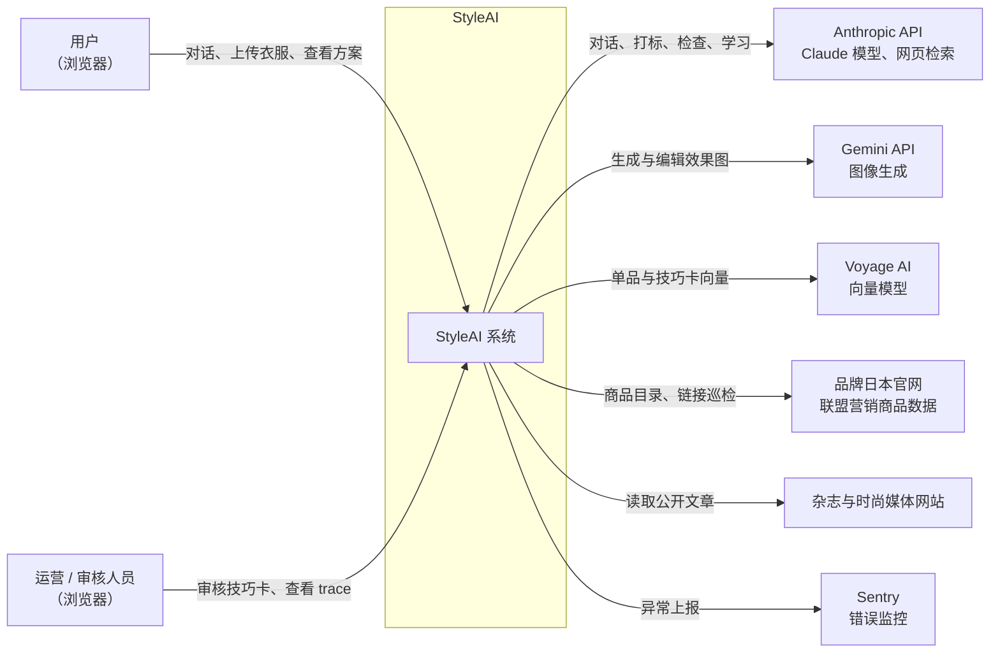
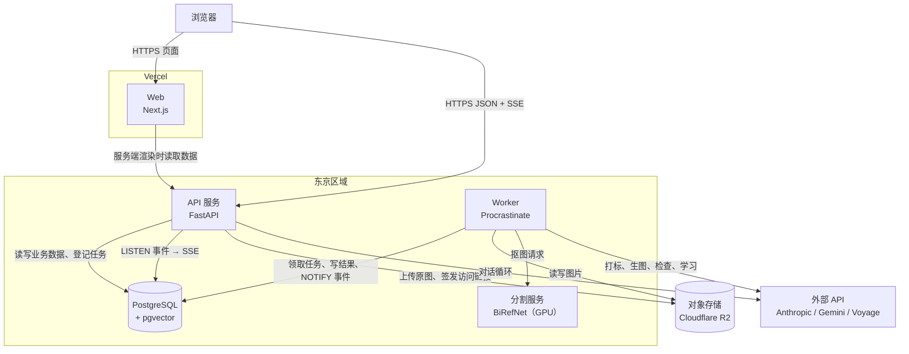
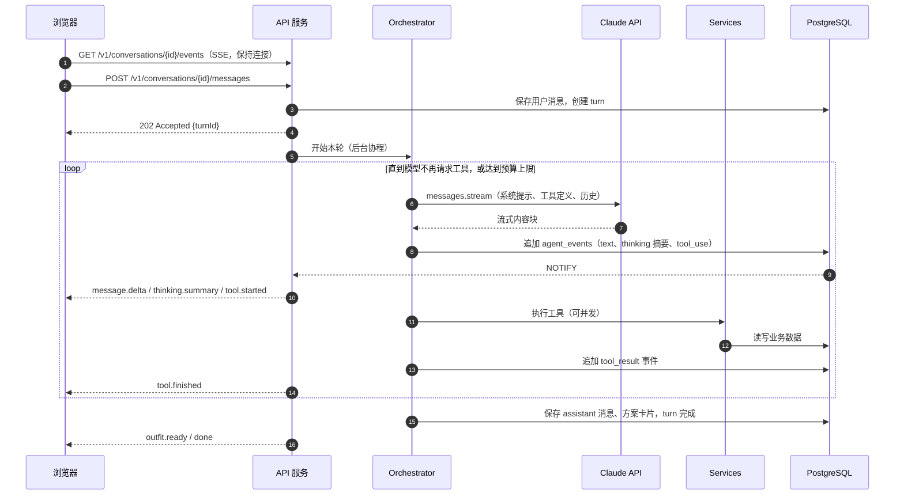
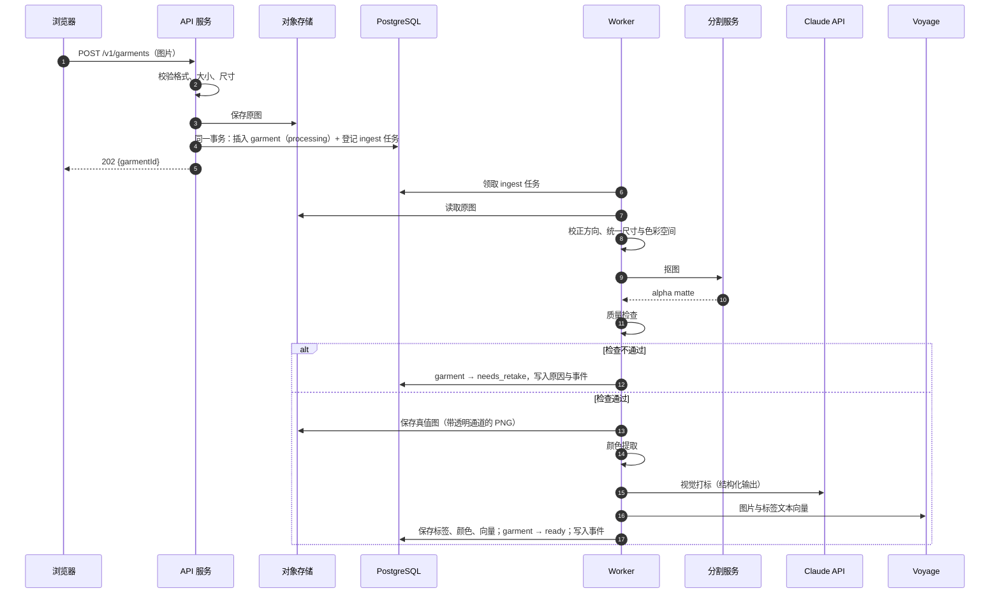
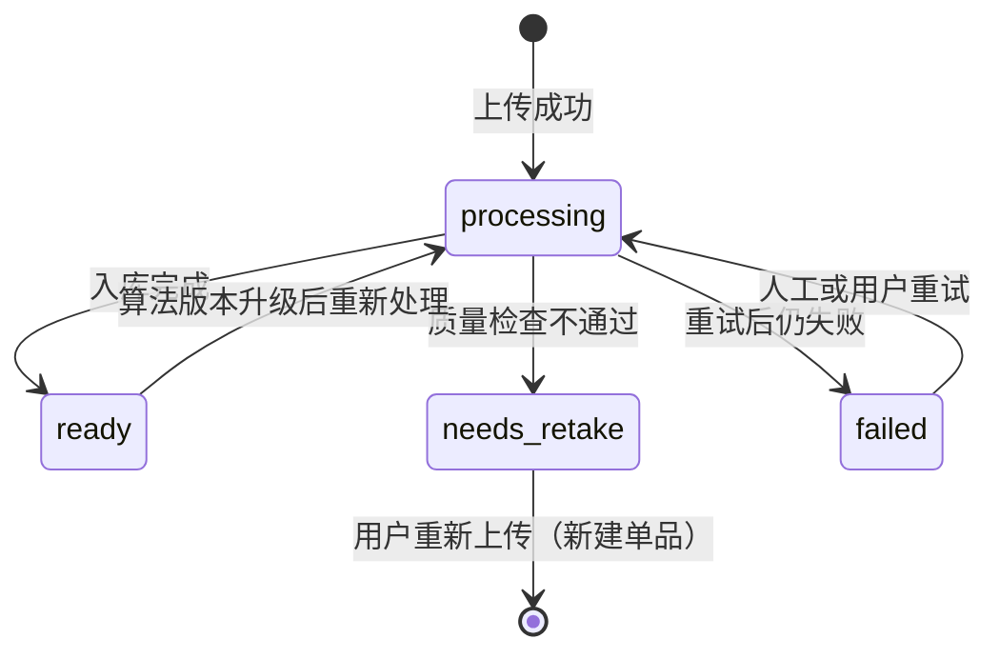
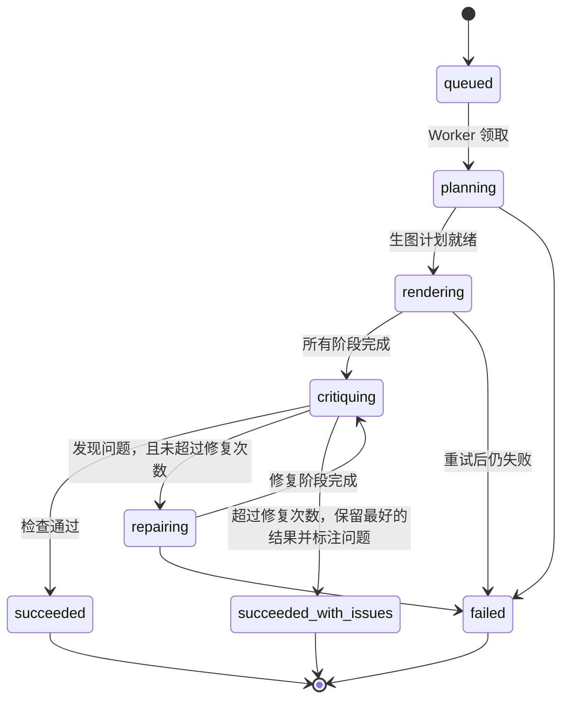
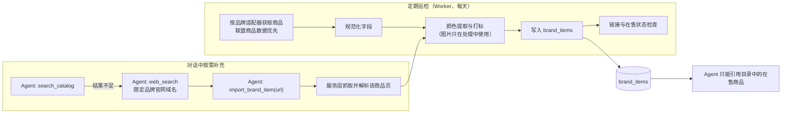
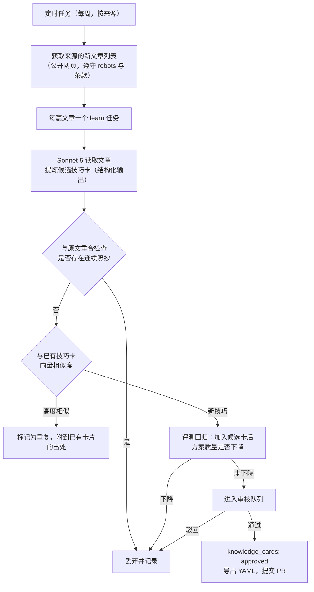
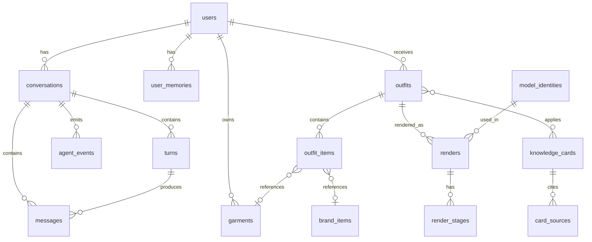

# 系统架构

> 语言：中文（摸索阶段只维护中文版；日文、英文旧稿见 [docs/archive](../archive/)，正式开发开始时重新翻译）
> 状态：草案 v0.1 · 更新：2026-09-16
> 本文描述 StyleAI v2 首个版本的系统结构：由哪些部分组成、各部分如何协作、数据怎样流动，以及出错时怎样处理。技术选型的理由见[《技术选型》](02-tech-stack.md)；其中涉及的技术原理，见 `tech-notes` 分支的[技术原理](https://github.com/ailuruschen-bit/stylist-agent/tree/tech-notes/docs/zh/tech-notes)系列文章。

## 1. 架构目标

架构设计服务于立项文档中的产品目标，并受到以下约束：

| 目标 | 架构上的体现 |
| --- | --- |
| 对话流畅，不让用户干等 | 对话结果流式推送；生图等耗时工作进入任务队列，不阻塞对话 |
| 效果图忠于用户的衣服 | 入库保存分割得到的真值图；效果图生成后与真值图对比检查 |
| 每个方案讲得出理由，出了问题查得到原因 | 方案引用技巧卡；Agent 每一步推理与工具调用都记录 trace |
| 模型可以替换 | LLM、生图、分割、向量模型都通过 provider 接口接入 |
| 成本可控 | 每轮对话、每个方案有 token 与生图次数上限，超限降级 |
| 合规 | 外部内容只存元数据与自己提炼的内容；外部网页内容一律视为不可信数据 |
| 基础设施简单 | 首个版本只依赖 PostgreSQL 与对象存储，不引入 Redis、消息中间件 |

约束：只做 Web 端；首发市场日本，服务部署在东京区域；团队规模小，优先选择托管服务，减少运维工作。

## 2. 系统上下文

StyleAI 与外部系统的关系：



| 外部系统 | StyleAI 发送什么 | 接收什么 | 数据敏感度 |
| --- | --- | --- | --- |
| Anthropic API | 对话历史、衣服图片与标签、工具结果 | 模型输出、检索结果 | 含用户上传图片，按 API 条款处理 |
| Gemini API | 模特参考图、服装真值图、生图提示词 | 生成的图片 | 含用户上传图片 |
| Voyage AI | 衣服图片、标签文本、技巧卡文本 | 向量 | 含用户上传图片 |
| 品牌官网、联盟渠道 | 商品查询请求 | 商品元数据、链接 | 不发送用户数据 |
| 杂志网站 | 公开文章请求 | 文章内容（只在处理过程中使用，不保存原文） | 不发送用户数据 |

用户上传的图片会发送给第三方模型服务。隐私政策中需要说明这一点，并在上线前确认各服务的数据使用条款（是否用于训练、保存期限）。

## 3. 容器视图

“容器”指可以独立部署、独立运行的部分：



| 容器 | 职责 | 伸缩方式 |
| --- | --- | --- |
| Web | 页面渲染、交互、消费 SSE 事件 | Vercel 自动伸缩 |
| API 服务 | 认证、REST 接口、对话循环（Agent Orchestrator）、SSE 推送、登记任务 | 无状态，水平扩展多个实例 |
| Worker | 执行任务：衣橱入库、多阶段生图、品牌巡检、杂志学习、停滞任务回收 | 按队列水平扩展；生图队列与其他队列分开部署 |
| 分割服务 | 输入图片，输出 alpha matte | GPU 实例，按调用量伸缩；M1 决定部署形态 |
| PostgreSQL | 业务数据、任务队列、事件、向量检索 | 托管服务，垂直扩容 + 只读副本（按需） |
| 对象存储 | 原图、真值图、效果图、各阶段中间图 | 托管服务 |

对话循环放在 API 服务里，而不是 Worker 里：一轮对话通常在十几秒内完成，需要把模型输出实时推给浏览器，由处理请求的进程直接驱动最简单。耗时超过这个量级的工作（生图、入库）一律进入任务队列。

## 4. 后端模块划分

API 服务与 Worker 共用 `apps/api` 一套代码，按职责分成以下包：

```text
app/
├── api/              HTTP routers, request/response schemas, SSE endpoint
├── agent/
│   ├── orchestrator  the conversation loop (one turn = several model calls)
│   ├── tools/        one module per agent tool; tools call services only
│   ├── prompts/      system prompts as versioned markdown files
│   └── budget        per-turn token and render limits
├── services/
│   ├── auth          sessions, users
│   ├── wardrobe      garments, tags, similarity search
│   ├── catalog       brand items, link checks
│   ├── outfits       looks, rule validation
│   ├── renders       render jobs, stages, critique results
│   ├── knowledge     technique cards, review workflow
│   ├── models        model identities (the built-in model roster)
│   ├── memory        user preferences and dislikes
│   ├── events        conversation and job events for SSE
│   └── credits       usage accounting
├── pipelines/
│   ├── ingest        segmentation -> QA -> colors -> tagging -> embeddings
│   ├── render        plan -> stages -> critique -> repair
│   ├── scout         brand catalog sweeps
│   └── learn         magazine reading -> candidate cards
├── providers/
│   ├── llm           Anthropic
│   ├── image         Gemini image models
│   ├── segmentation  BiRefNet service client
│   ├── embedding     Voyage
│   └── storage       R2 / local filesystem
├── repositories/     database access, one module per aggregate
└── worker/           Procrastinate app and task definitions
```

依赖方向只能从上往下，不允许反向或跨层：

```text
api ─────────┐
agent/tools ─┼──► services ──► repositories ──► PostgreSQL
worker ──────┘        │
   │                  └──────► providers ──► 外部 API / 对象存储
   └──► pipelines ──► services / providers
```

- `agent/tools` 与 `pipelines` 不直接访问 `repositories`，业务规则只写在 `services` 里一处。
- `providers` 不依赖任何业务模块，只做外部服务的调用、重试、计量。
- `services` 之间可以相互调用，但不能形成循环依赖；出现循环时，把共同依赖的部分抽成新的服务。

## 5. 核心流程

### 5.1 一轮对话

一轮对话从用户发送消息开始，到 Agent 给出回复结束。浏览器通过两个接口参与：一个发送消息，一个订阅事件流。



几个设计要点：

- **发送与订阅分离。** `POST messages` 立即返回 `202`，真正的输出通过事件流到达。页面刷新或网络断开后，浏览器重新订阅即可，不会丢失正在进行的这一轮。
- **事件先落库，再推送。** 所有事件先写入 `agent_events` 表（每个会话内 `seq` 递增），再通过 `NOTIFY` 通知 API 实例推送。浏览器重连时带上 `Last-Event-ID`，API 从数据库补发缺失的事件。多个 API 实例部署时，任何一个实例都能为浏览器补发和推送。
- **同一会话同一时刻只有一轮在执行。** 上一轮未结束时用户再发消息，新消息排在后面，上一轮结束后自动开始。
- **本轮 Orchestrator 所在进程崩溃时**，turn 停留在 `running` 状态。回收任务发现超时的 turn 后将其标记为 `interrupted`，向用户推送可重试的错误事件。已经保存的消息和工具结果不受影响。

### 5.2 衣橱入库



**单品状态：**



**质量检查**（阈值为初始值，M1 用真实照片校准）：

| 检查项 | 判断方法 | 不通过时提示用户 |
| --- | --- | --- |
| 主体面积 | 前景像素占画面 5%～90% | 衣服太小或拍得太近 |
| 是否被裁切 | 前景触碰图片边缘的长度占边长比例 | 衣服没有拍全 |
| 主体数量 | 前景连通区域中，面积大于最大区域 20% 的个数 | 画面里有多件衣服 |
| 清晰度 | 前景区域的拉普拉斯方差 | 照片模糊 |
| 分割置信度 | alpha 中介于 0.2～0.8 的像素比例 | 背景太复杂，建议换纯色背景 |

**打标输出**使用结构化输出约束为固定 Schema，每个字段附带模型给出的置信度。置信度低于阈值的字段，用 Sonnet 5 复核一次；仍然不确定的字段在界面上标记为“待确认”，由用户选择。

**任务设计：** 入库任务用 `queueing_lock = garment:{id}` 防止重复登记；每个步骤的产物（归一化图、alpha、真值图）按单品编号保存，任务重试时已存在的产物直接复用。

### 5.3 多阶段生图

Agent 调用 `render_look` 时，服务层在同一事务中创建 `renders` 记录并登记生图任务（队列 `render`，`lock = outfit:{id}`），然后立即返回任务编号。

**生图任务状态：**



**规划。** Worker 把方案（单品、层次角色、穿法）、各单品的真值图与标签、选定模特的参考图信息交给 Claude Opus 5，要求用结构化输出生成生图计划：

```json
{
  "complexity": "multi_stage",
  "stages": [
    {
      "no": 1,
      "goal": "Base look: model wearing the white tee and indigo straight jeans",
      "inputs": ["model:M-004/front", "garment:G-000102", "garment:G-000131"],
      "must_keep": ["jeans indigo wash and fading", "tee neckline shape"],
      "prompt": "..."
    },
    {
      "no": 2,
      "goal": "Tie the grey hoodie around the waist, sleeves knotted at the front",
      "inputs": ["stage:1", "garment:G-000127"],
      "must_keep": ["heather grey texture", "navy chest logo visible on the hanging body"],
      "prompt": "..."
    }
  ],
  "checks": [
    "hoodie is tied at the waist, not worn",
    "jeans color matches G-000102 within tolerance",
    "full body in frame, 3:4"
  ]
}
```

`prompt` 字段由模型根据方案现写，代码中不存在固定的生图提示词模板。

**逐阶段生成。** 每个阶段调用图像 provider：第一阶段用 `generate`（模特参考 + 服装参考），之后的阶段用 `edit`（上一阶段结果 + 新增服装参考）。每个阶段完成后：

1. 图片保存到对象存储；
2. 在 `render_stages` 中记录输入、提示词、模型、耗时、成本；
3. 写入 `render.stage` 事件，浏览器实时显示阶段图。

**检查与修复。** 所有阶段完成后，Claude Opus 5 对照计划中的 `checks` 和各单品的真值图检查最终图，输出结构化结果：

```json
{
  "pass": false,
  "issues": [
    { "stage": 2, "type": "wear_not_executed", "detail": "The hoodie is worn over the tee instead of tied at the waist." }
  ]
}
```

不通过时，按 `issues` 定位到对应阶段，重新生成该阶段及其后续阶段，或对最终图做局部编辑。修复次数上限初始为 2 次。

**续跑。** 任务因 Worker 崩溃被重新执行时，读取 `render_stages` 中已经成功的阶段，从第一个未完成的阶段继续，不重复生成已完成的图片。

**预算。** 每个生图任务的图像调用次数上限初始为 8 次（含修复）。达到上限时停止修复，保留检查问题最少的结果，状态记为 `succeeded_with_issues`，并在方案卡片上提示。

### 5.4 品牌目录

品牌商品通过两条路径进入目录：



- **品牌适配器**：每个品牌一个模块，负责从该品牌的数据来源获取商品、映射到统一字段。数据来源的选择遵循《内容来源清单》第 2.1 节。
- **引用约束在服务层强制执行**：`save_outfit` 校验方案中的每个品牌商品都存在于 `brand_items` 且状态为在售，不满足时返回错误给 Agent，而不是只靠提示词约束。
- **外部网页是不可信数据**：商品页和检索结果中的文字可能包含针对模型的指令。解析后只把结构化字段交给 Agent，不把网页原文拼进系统提示词。

### 5.5 杂志学习



- 文章原文只在任务执行期间存在于内存中，用于提炼与重合检查，任务结束后不保存。
- 重合检查的初始规则：技巧卡任一字段与原文存在长度超过 30 个字符的公共子串，即判定为照抄。
- 审核界面展示候选卡、出处链接、评测结果与相似的已有卡片，审核人员可以编辑后通过。

## 6. 数据模型

### 6.1 实体关系



### 6.2 主要表

所有表使用 UUID 主键（技巧卡除外），带时区的 `created_at` 与 `updated_at`；以下只列出关键字段。

| 表 | 关键字段 | 说明 |
| --- | --- | --- |
| `users` | email、password_hash、display_name、locale、role | locale 为 zh-CN / ja / en |
| `user_memories` | user_id、kind（like / dislike / occasion / note）、content、source_turn_id | Agent 通过工具读写，用户可以查看和删除 |
| `conversations` | user_id、title、status | |
| `turns` | conversation_id、status（queued / running / completed / interrupted / failed）、usage、cost_usd | 一轮对话的执行记录与成本 |
| `messages` | conversation_id、turn_id、role、content（JSONB） | content 原样保存 API 的内容块，用于下一轮请求 |
| `agent_events` | conversation_id、seq、turn_id、type、payload | 主键（conversation_id, seq），SSE 补发的数据来源 |
| `garments` | user_id、status、original_key、cutout_key、category、colors、attributes、alt_wears、tag_confidence、method_versions、image_embedding、text_embedding | colors 结构见技术原理《衣服的颜色怎样变成数据》 |
| `brand_items` | brand、external_id、url、title、category、colors、attributes、price_jpy、availability、line（staple / new）、source、fetched_at、last_checked_at、embedding | 唯一约束（brand, external_id） |
| `outfits` | user_id、turn_id、occasion、palette_logic、reasoning、status | |
| `outfit_items` | outfit_id、garment_id 或 brand_item_id、layer_role、wear_style、position | 检查约束：两个外键恰好一个非空；wear_style 如 normal / tied_waist / one_sleeve_off |
| `outfit_cards` | outfit_id、card_id | 方案引用的技巧卡 |
| `renders` | outfit_id、model_identity_id、status、plan、final_key、image_calls、cost_usd、issues | |
| `render_stages` | render_id、stage_no、attempt、goal、prompt、input_keys、output_key、provider、model、latency_ms、cost_usd、critique | 唯一约束（render_id, stage_no, attempt） |
| `knowledge_cards` | id（K-0001）、status、title、terms、when_to_use、how、avoid、tags、season_scope、expires_at、confidence、embedding、origin（human / pipeline）、reviewed_by | |
| `card_sources` | card_id、outlet、title、url、accessed_at | |
| `content_sources` | outlet、type、priority、base_url、enabled、last_crawled_at | 对应《内容来源清单》 |
| `model_identities` | code（M-004）、display_name、presentation、archetype、reference_keys、generator、generated_at、license、similarity_check、active | |
| `usage_events` | user_id、kind、amount、ref_id | 额度流水，沿用 demo 设计 |
| `procrastinate_*` | 由 Procrastinate 管理 | 通过它提供的迁移脚本创建 |

向量字段使用 pgvector 的 `vector` 类型，维度随所选向量模型确定；按查询方式建立 HNSW 索引。

## 7. Agent 设计

### 7.1 上下文的组成

每次调用 Claude 时，请求内容按“越稳定越靠前”的顺序排列，以便提示缓存命中：

| 顺序 | 内容 | 变化频率 | 缓存 |
| --- | --- | --- | --- |
| 1 | 工具定义 | 随版本发布 | 缓存 |
| 2 | 系统提示词：人格、造型原则、输出要求 | 随版本发布 | 缓存 |
| 3 | 技巧卡索引（标题与标签，不含正文） | 知识库更新时 | 缓存 |
| 4 | 用户记忆摘要、衣橱概况（件数与类目分布） | 每轮可能变化 | 不缓存 |
| 5 | 对话历史 | 每轮追加 | 历史前缀可缓存 |
| 6 | 本轮用户消息 | 每轮 | — |

技巧卡正文不直接放进上下文，由 Agent 通过 `retrieve_techniques` 按需检索。对话很长时，使用 API 的服务端压缩功能总结较早的历史；方案、衣橱等事实性信息始终以数据库为准，可以随时通过工具重新查询。

### 7.2 工具清单

| 工具 | 作用 | 是否修改数据 | 耗时 |
| --- | --- | --- | --- |
| `search_wardrobe` | 按类目、颜色、风格、相似度检索用户衣橱 | 否 | 短 |
| `get_garment` | 读取单件衣服的完整标签与颜色 | 否 | 短 |
| `retrieve_techniques` | 按场景与单品检索技巧卡正文 | 否 | 短 |
| `search_catalog` | 在品牌目录中检索商品 | 否 | 短 |
| `web_search`（服务端工具） | 在品牌官网域名范围内检索 | 否 | 中 |
| `import_brand_item` | 把检索到的商品页解析并加入目录 | 是（目录） | 中 |
| `validate_outfit` | 用配色与层次规则检查候选方案 | 否 | 短 |
| `save_outfit` | 保存方案，校验单品存在、品牌商品在售 | 是 | 短 |
| `render_look` | 创建生图任务，立即返回任务编号 | 是（登记任务） | 短 |
| `get_render_status` | 查询生图任务进度与检查结果 | 否 | 短 |
| `list_models` | 查询可用模特及其风格原型 | 否 | 短 |
| `remember_preference` | 记录用户明确表达的偏好或禁忌 | 是（记忆） | 短 |

所有修改数据的工具都是幂等的：同一轮对话中以相同参数重复调用，不会产生重复记录。

### 7.3 预算与降级

每轮对话在 Orchestrator 中检查以下上限（初始值，M0 实测后调整）：

| 上限 | 初始值 | 达到时 |
| --- | --- | --- |
| 单轮模型调用次数 | 12 次 | 要求 Agent 基于已有信息给出回答 |
| 单轮输出 token | 32K | 同上 |
| 单轮新建生图任务 | 2 个 | `render_look` 返回错误，说明已达上限 |
| 单个生图任务的图像调用 | 8 次 | 见 5.3 节 |

上限触发时写入 trace，便于分析是提示词问题还是需求本身复杂。

## 8. 实时事件

浏览器通过一条 SSE 连接接收某个会话的全部事件，包括对话输出和该会话中生图任务的进度：

```text
GET /v1/conversations/{id}/events
Last-Event-ID: 128          ← 重连时由浏览器自动带上

id: 129
event: render.stage
data: {"seq":129,"renderId":"...","stageNo":2,"imageUrl":"..."}
```

- **事件来源**：API 中的 Orchestrator 与 Worker 中的流水线都通过 `services.events` 写事件，写入与业务数据在同一事务中提交，并在提交时 `NOTIFY`。
- **推送**：每个 API 实例对自己持有 SSE 连接的会话执行 `LISTEN`，收到通知后从 `agent_events` 读取 `seq` 大于已发送值的事件推送。
- **补发**：连接建立时，按 `Last-Event-ID` 从数据库补发。通知丢失不会导致事件丢失，最多延迟到下一次通知或兜底轮询（5 秒）。
- **保活**：每 15 秒发送一次 SSE 注释行，避免代理和负载均衡断开空闲连接。

事件类型定义见《开发规范》第 8 节。

## 9. API 概览

| 方法 | 路径 | 说明 |
| --- | --- | --- |
| POST | `/v1/auth/login`、`/v1/auth/logout` | 会话登录与退出 |
| GET | `/v1/me` | 当前用户信息与额度 |
| GET、POST | `/v1/conversations` | 会话列表、新建会话 |
| POST | `/v1/conversations/{id}/messages` | 发送消息，返回 202 与 turnId |
| GET | `/v1/conversations/{id}/events` | SSE 事件流 |
| GET | `/v1/conversations/{id}/messages` | 历史消息（分页） |
| POST | `/v1/garments` | 上传衣服，返回 202 与 garmentId |
| GET | `/v1/garments`、`/v1/garments/{id}` | 衣橱列表与详情 |
| PATCH | `/v1/garments/{id}` | 用户修正标签 |
| DELETE | `/v1/garments/{id}` | 删除衣服及其图片 |
| GET | `/v1/outfits`、`/v1/outfits/{id}` | 方案列表与详情 |
| POST | `/v1/outfits/{id}/renders` | 用户主动重新生成效果图 |
| GET | `/v1/renders/{id}` | 生图任务详情与各阶段图片 |
| GET、DELETE | `/v1/me/memories` | 查看、删除 Agent 记住的偏好 |
| GET | `/v1/models` | 模特列表 |
| GET、POST | `/v1/admin/cards/review` | 候选技巧卡审核（管理员） |
| GET | `/v1/admin/traces/{turnId}` | Agent trace（管理员） |

请求与响应格式、错误格式、分页规则见《开发规范》第 8 节。

## 10. 文件存储

对象存储按以下前缀组织，所有对象默认私有：

```text
users/{userId}/garments/{garmentId}/original.jpg
users/{userId}/garments/{garmentId}/normalized.jpg
users/{userId}/garments/{garmentId}/alpha.png
users/{userId}/garments/{garmentId}/cutout.png
users/{userId}/renders/{renderId}/stage-{no}-{attempt}.png
users/{userId}/renders/{renderId}/final.png
models/{modelCode}/{view}.png
```

- 浏览器通过 API 签发的短期签名链接（有效期 10 分钟）访问图片。
- 用户删除衣服或注销账号时，删除对应前缀下的所有对象；生图中间图在任务完成 30 天后清理，最终图保留。
- 品牌商品图片不写入对象存储（见《内容来源清单》第 2.1 节）。

## 11. 安全与隐私

| 方面 | 措施 |
| --- | --- |
| 认证 | httpOnly、Secure、SameSite=Lax 的会话 Cookie；会话在服务端可撤销 |
| CSRF | 修改数据的接口校验请求来源，并要求自定义请求头 |
| 数据隔离 | 所有查询按 `user_id` 过滤，由仓储层统一加条件；管理员接口单独鉴权 |
| 上传 | 校验文件真实类型与尺寸，重新编码图片，去除 EXIF 中的位置信息 |
| 外部内容 | 网页、检索结果、杂志文章视为不可信数据：只提取结构化字段，不拼入系统提示词；工具结果中标明来源 |
| Agent 权限 | Agent 只能调用第 7.2 节的工具；工具只能访问当前用户的数据 |
| 密钥 | 只存在于部署平台的密钥管理中；日志中过滤 |
| 限流 | 按用户限制消息频率、上传频率、生图次数 |
| 删除 | 用户可删除衣服、方案、记忆与账号；删除同步清理对象存储 |

## 12. 可观测性

- **请求链路**：每个 HTTP 请求生成 `trace_id`，登记任务时写入任务参数，Worker 执行时沿用，外部 API 调用都带上这个 ID 记录。
- **Agent trace**：`turns`、`agent_events`、`render_stages` 共同构成一轮对话的完整记录，管理员 trace 页面按时间线展示每次模型调用的输入摘要、输出、工具入参与结果、token、耗时、成本。
- **指标**：

| 指标 | 用途 |
| --- | --- |
| 首个 `message.delta` 的延迟 | 对话体验 |
| 每轮模型调用次数、token、成本 | 成本与提示词质量 |
| 入库各步骤耗时与 `needs_retake` 比例 | 分割与拍摄引导的效果 |
| 生图各阶段耗时、修复次数、`succeeded_with_issues` 比例 | 生图质量 |
| 队列积压数量与任务等待时间 | Worker 容量 |
| 外部 API 错误率与限流次数 | 供应商稳定性 |

- **告警**：外部 API 错误率持续升高、队列积压超过阈值、生图失败率升高时通知。

## 13. 失败处理

| 失败 | 系统行为 | 用户看到 |
| --- | --- | --- |
| Claude API 限流或暂时不可用 | SDK 自动重试；仍失败则本轮 `failed` | 可重试的错误提示 |
| 模型拒绝回答 | 按服务端回退配置切换模型；仍被拒绝则结束本轮 | 说明无法处理该请求 |
| 工具执行出错 | 以 `is_error` 返回给模型，由模型调整 | 通常无感知 |
| API 进程在对话中崩溃 | turn 被标记为 `interrupted` | 可重试的错误提示 |
| 分割服务不可用 | 入库任务按重试策略延后执行 | 衣服保持“处理中” |
| 生图 API 失败 | 该阶段按重试策略重试；超过次数则任务 `failed` | 方案卡片显示“效果图生成失败，可重试”，不扣额度 |
| Worker 崩溃 | 停滞任务由定时任务放回队列，从未完成的阶段继续 | 进度暂停后恢复 |
| 品牌商品下架 | 巡检更新状态；已保存方案中标记“已下架” | 方案中该单品显示下架提示与替代建议入口 |
| 数据库不可用 | API 返回 503；Worker 暂停领取 | 服务暂时不可用 |

## 14. 部署

| 环境 | 用途 | 数据 |
| --- | --- | --- |
| local | 开发 | Docker 中的 PostgreSQL，本地文件系统存储；外部 API 使用开发密钥 |
| staging | 集成验证、评测 | 独立数据库与存储桶，测试账号 |
| production | 正式服务 | 东京区域 |

- **发布**：合入 `main` 后，CI 运行 lint、类型检查、测试；通过后自动部署到 staging，手动确认后发布到 production。
- **数据库迁移**：发布时先执行 Alembic 迁移，再发布新代码。迁移必须向前兼容上一个版本的代码，避免发布过程中新旧实例同时运行时出错。
- **Worker 发布**：先停止领取新任务，等待正在执行的任务完成或达到超时，再替换进程；未完成的任务由停滞回收机制接管。

## 15. 相关文档

- [立项文档](01-project-charter.md)
- [技术选型](02-tech-stack.md)
- [开发规范](03-dev-guidelines.md)
- [内容来源清单](04-content-sources.md)
- [技术原理（tech-notes 分支）](https://github.com/ailuruschen-bit/stylist-agent/tree/tech-notes/docs/zh/tech-notes)
