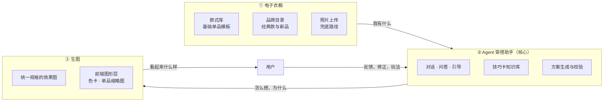
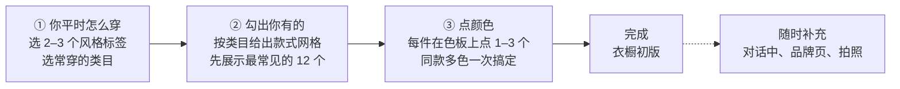

# 产品形态与交互流程

> 语言：中文（摸索阶段只维护中文版）
> 状态：草案 v0.1 · 更新：2026-09-16
> 本文回答“这个产品长什么样、用户怎么用”。产品目标见[《立项文档》](01-project-charter.md)，系统结构见[《系统架构》](05-system-architecture.md)。本文确定的交互形态，会反过来修改这两份文档，需要修改的地方列在第 9 节。

## 1. 三个模块



三者的分工可以用三句话概括：

| 模块 | 回答的问题 | 失败时的表现 |
| --- | --- | --- |
| 电子衣橱 | 这个人**有什么** | 推荐了用户没有的衣服，或漏掉了用户有的 |
| Agent 助手 | **怎么搭**、**为什么**这样搭 | 方案说不出理由，或者只会给安全牌 |
| 生图 | 穿上**看起来什么样** | 图里的衣服不是用户的那件，或者不好看 |

**衣橱的质量决定 Agent 的上限。** 用户衣橱越完整，Agent 越能优先用已有的衣服；衣橱空着的时候，产品会退化成一个泛泛的穿搭问答。所以第 2 节的录入体验，是整个产品最先要解决的问题。

## 2. 电子衣橱：以“选款”为主，“拍照”为辅

### 2.1 为什么不让用户一张张拍

一个普通人的衣橱有 50 到 200 件。按拍照路径：每件要找光线、平铺、拍摄、等待入库、检查抠图、必要时重拍，一件按 40 秒算，100 件就是一个多小时的重复劳动。**绝大多数用户会在第 10 件之前放弃**，产品拿到的是一个残缺的衣橱，之后每一条建议都建立在错误的前提上。

所以主路径改成“**从库里挑出我有的**”：认出一件衣服比拍好一件衣服快得多，勾选一次不到 3 秒。

这个选择有代价，必须说清楚：**选款得到的不是用户那件衣服本身，而是它的“同款替身”。** 颜色可能差一点，洗白的程度、起球、改过的裤长都没有。因此：

- 效果图的服装参考图来自款式库，而不是用户的真值图；服装还原度的问题，从“抠图准不准”变成“**款式库的图准不准**”（见第 9 节对技术文档的影响）。
- 用户觉得某件衣服“就是不一样”时，随时可以用照片路径补一张真值图，覆盖替身。

### 2.2 三条录入路径

| 路径 | 用户做什么 | 系统得到什么 | 适合 |
| --- | --- | --- | --- |
| **A 款式库选款** | 选类目 → 选款式 → 点颜色 | 款式模板 + 颜色 + 材质，标准化单品 | 基础款、说不出品牌的衣服（预计覆盖 70–80%） |
| **B 品牌目录** | 搜索或浏览品牌 → 选中商品 | 精确到具体商品，含官方商品信息与链接 | 知名品牌的经典款、当季新品 |
| **C 照片上传** | 拍一张 | 真值图 + 自动标签 | 有特点、库里没有、或替身不像的单品 |

三条路径产出的都是衣橱里的一件 `garment`，区别只在 `source` 字段和参考图的来源。Agent 在使用时不区分路径，但在生图时知道参考图的可信度不同。

### 2.3 款式模板是什么

款式库的一条记录叫**款式模板**（style template），它描述“这一类衣服长什么样”，不包含颜色：

```yaml
id: ST-TOP-HOODIE-DROP
category: tops
subcategory: hoodie
name: { zh: 落肩宽松连帽卫衣, en: Drop-shoulder oversized hoodie }
attributes:
  fit: oversized            # slim | regular | oversized
  shoulder: drop            # set_in | drop | raglan
  neckline: hood
  closure: pullover         # pullover | half_zip | full_zip
  sleeve_length: long
  body_length: regular      # crop | regular | long
  pocket: kangaroo
  details: [drawstring, ribbed_cuff]
colorways: open             # 用户从色板里点选，不限定
materials: [french_terry, fleece, heavy_cotton]
patterns: [solid, heather, logo_print]
reference_images:
  flat: ST-TOP-HOODIE-DROP/flat.png      # 白底平铺标准图，用于生图参考
  front: ST-TOP-HOODIE-DROP/front.png    # 上身正面
formality: 1
seasons: [spring, autumn, winter]
```

用户衣橱里的一件衣服，就是**模板 + 颜色 + 材质 + 图案 + 备注**：

```json
{
  "garmentId": "G-000127",
  "source": "template",
  "templateId": "ST-TOP-HOODIE-DROP",
  "color": { "hex": "#8D8E92", "name": { "zh": "麻灰" } },
  "material": "french_terry",
  "pattern": "heather",
  "note": "袖口有点松了"
}
```

生图时，参考图 = 模板的标准图按所选颜色着色后的结果。着色在我们这边完成（标准图保留明暗层次的灰度通道，按目标颜色重新上色），不交给生图模型，这样颜色一定准确。

### 2.4 分类要细到什么程度

太粗（“卫衣”）会让不同版型的衣服混成一件；太细（区分 3 厘米的衣长差）会让用户找不到。判断标准只有一条：**这个区分会不会改变搭配建议或效果图的样子。**

- 会改变：版型（合身 / 宽松）、领型、衣长、袖长、门襟形式、裤型、鞋型。
- 不会改变：品牌 logo 的具体位置、口袋的缝线样式、纽扣材质。

按这个标准，一级类目 6 个（上装、外套、下装、连衣裙、鞋、配饰），二级 40 个左右，款式模板首批目标 **250–350 个**，覆盖常见衣橱的 80%。数量在 M1 用真实衣橱清单校准。

### 2.5 五分钟建起第一版衣橱

首次进入的引导流程分三步，目标是 5 分钟内建出 30–50 件：



几个设计点：

- **先勾款式，后点颜色。** 两件事分开做，认知负担小得多；同一个款式有三件不同颜色时，点三下就完成三件。
- **网格里的每个款式用同一套视觉呈现**（白底平铺图 + 名称），扫视速度最快。
- **不要求一次建完。** 引导结束后进入产品，Agent 在对话中发现缺口时主动问：“这套还需要一双白色板鞋，你有吗？”——回答“有”就直接入库。
- **补充比纠正容易。** 宁可先少录，让用户在使用中慢慢补，也不要一上来就让人对着 300 个款式挑花眼。

### 2.6 品牌单品怎么精准选中

| 方式 | 场景 |
| --- | --- |
| 搜索（品牌 + 关键词） | “优衣库 宽松 T”——知道自己买的是什么 |
| 按品牌浏览类目 | 想不起名字，但记得是哪家买的 |
| 粘贴商品页链接 | 从官网或社交平台看到的具体商品 |
| 经典款速选 | 每个品牌维护一份“经典款”清单（例如某几款常年在售的基础单品），直接勾选 |

选中品牌商品时，一并记录尺码与购买时间（可跳过）。品牌数据的来源与使用规则见[《内容来源清单》](04-content-sources.md)。

## 3. Agent 穿搭助手：交互模式

### 3.1 四个入口

| 入口 | 用户的心理状态 | 系统的第一反应 |
| --- | --- | --- |
| **对话框** | “我想聊聊” | 正常对话，先问清场合 |
| **今日穿搭** | “别问了，直接给我一套” | 直接出 1–2 套，附一句理由，不提问 |
| **从单品出发** | “这件我想穿，配什么” | 以该单品为轴心给 2–3 种方向 |
| **玩法**（色卡 / slot） | “随便逛逛” | 进入第 5、6 节的玩法流程 |

四个入口最终都汇入同一套对话状态，用户可以在任何一步转回对话继续问。

### 3.2 一轮对话的输出结构

```text
① 一句话回应（正在做什么 / 结论）
② 方案卡片（一到两张）
   · 单品列表：缩略图 + 来源 + 层次角色 + 穿法
   · 配色说明（色卡形式，见第 5 节）
   · 展开可看：为什么好看、引用的技巧卡
③ 效果图（异步到达，先占位后填充）
④ 下一步（2–3 个可点的建议：换一件 / 换配色 / 换场合 / 生成更多）
```

**先给方案，再补细节。** 除非信息完全不足（连场合都不知道），否则不要连问三个问题再出方案——用户改一次方案的成本，远低于回答三个问题。

### 3.3 什么时候提问，怎么问

- 一次只问**一个**最关键的问题，并给出 2–3 个可点选项，用户不必打字。
- 信息不足时的优先级：场合 > 天气或温度 > 想要的感觉 > 具体单品偏好。
- 用户说“随便”“你定”时，不再追问，直接给方案并说明假设：“我按周末逛街、20 度左右来搭，不合适告诉我。”

### 3.4 Agent 的主动性边界

| 可以主动 | 不要主动 |
| --- | --- |
| 指出衣橱缺口（“缺一件浅色外套”） | 反复推销购买 |
| 提出一个“意外但成立”的穿法 | 否定用户的审美 |
| 记住明确说过的偏好与禁忌 | 猜测并记录没说过的事 |
| 说明某个组合为什么不成立 | 评判身材 |

### 3.5 Agent 与衣橱的读写关系

- **读**：检索衣橱、查看单品详情、查相似单品。
- **写**（都需要用户确认）：新增单品（从对话中确认“你有这件吗”）、修正标签、记录偏好。

## 4. 生图：视觉规格

### 4.1 参考视频里能看到什么

参考的是[色卡变装](https://youtube.com/shorts/HE3dTpUPlc4)与[截图选搭配](https://youtube.com/shorts/JqCswsYyBj0)两条视频。我逐帧看了画面（看不到声音与完整剪辑），能确定的画面要素：

| 要素 | 观察到的做法 |
| --- | --- |
| 背景 | 纯白，无缝，无道具、无阴影投射 |
| 人物 | 全身入画，头顶到鞋完整，居中 |
| 姿势 | 站姿或轻微动态（迈步、抬手），不夸张 |
| 光线 | 高调柔光，明暗过渡平缓，几乎没有硬阴影；人物边缘与白背景仍能分开 |
| 色彩 | 饱和但干净，没有灰调滤镜；衣服的色块关系一眼可读 |
| 图形元素 | 色卡、色号标签、单品缩略图是**叠加在画面上的图形**，不是拍出来的 |
| 画幅 | 竖构图（9:16） |

**最后一条是关键的技术判断**：视频里的色卡、色号文字、顶部的单品缩略图，都是后期加的图形层。我们也必须这么做——把它们交给生图模型，文字会被画错、色块颜色会偏（原因见技术原理《拆解“抠图”》与《多阶段生图的一致性》）。**图形层由前端绘制，模型只负责画人和衣服。**

### 4.2 出图规格

| 项目 | 规格 |
| --- | --- |
| 画幅 | 卡片内 3:4；变装 / 分享模式 9:16 |
| 构图 | 全身居中，头顶与鞋留白均衡 |
| 背景 | 纯白到极浅中性灰的无缝背景 |
| 光线 | 柔和主光 + 补光，轮廓与背景可分离，无硬投影 |
| 色调 | 白平衡准确，服装颜色以参考图为准，不加整体滤镜 |
| 模特 | 同一套造型的所有图片使用同一位模特 |

**同一模特、同姿势、同机位**是色卡切换能不能连贯的前提，这一项还没定（见第 10 节）。本文其余部分按“统一规格”来设计。

### 4.3 生成与合成的分工

```text
生图模型负责：模特 + 身上的衣服          → 一张干净的人物图
前端图形层负责：色卡、色号、单品缩略图、  → 叠在人物图上
               槽位、标题、分享水印
```

这样做的三个好处：文字永远正确；改一个色块不用重新生图；用户可以和图形层交互（点色卡、锁槽位）。

## 5. 色卡变装

### 5.1 参考视频里的创意

人站在一张放大的色卡里，或者被一叠色卡围绕，卡片上有色号标签，身上的衣服颜色和卡片颜色对应；切下一张卡，人和衣服一起换。**颜色是主角，衣服是颜色的载体。**

### 5.2 我们的色卡从哪来

不需要造一套色卡体系——每套方案本来就有自己的配色，[《衣服的颜色怎样变成数据》](https://github.com/ailuruschen-bit/stylist-agent/blob/tech-notes/docs/zh/tech-notes/02-garment-color-extraction.md)里的算法已经能算出主色、点缀色的 hex、占比和三语名称。一套造型可以直接翻译成一张色卡：

```text
┌─────────┬─────────┬─────────┬─────────┐
│ 麻灰     │ 靛蓝     │ 米白     │ 藏青     │
│ #8D8E92 │ #3A4A6B │ #EDECE6 │ #222C54 │
│ 卫衣 68% │ 牛仔 22% │ 内搭 7%  │ 胸标 3%  │
└─────────┴─────────┴─────────┴─────────┘
```

**注意商标**：Pantone 的色号体系与色卡外观是注册商标，我们不使用它的编码，也不模仿它的卡片版式。我们用自己的色名（中日英）、hex 值和占比；卡片形状做成自己的样式。

### 5.3 三种用法

| 用法 | 交互 | 用在哪 |
| --- | --- | --- |
| **切换器** | 效果图下方一条色卡，点一个色块或左右滑动，模特身上对应的单品换成那个颜色，人物和姿势不变 | 看同一套造型的不同配色 |
| **入口** | 先选一张配色方案（3–5 个色块），Agent 按这张色卡从衣橱组出造型 | “今天想穿得清爽一点”这类以颜色为起点的需求 |
| **档案** | 衣橱和历史方案按色系排列，翻起来像一本色卡册 | 浏览、找灵感、发现自己的衣橱缺什么颜色 |

### 5.4 切换时换的是什么

这是这个玩法最重要的设计判断：**用户点了一个新颜色，那件衣服他有吗？**

| 模式 | 规则 | 界面表达 |
| --- | --- | --- |
| **衣橱内切换**（默认） | 只在用户真正拥有的同类单品里换，点色块 = 换成衣橱里那件蓝色卫衣 | 正常显示 |
| **设想模式** | 允许换成用户没有的颜色，用来探索“这件如果是米色会怎样” | 该色块标注“你还没有”，可一键加入愿望单或去品牌目录找同色 |

两种模式都要有，默认在衣橱内切换，切到底之后再提示“想看看其他颜色吗”。**不做这个区分，产品会不断展示用户穿不了的造型。**

### 5.5 生成成本

换一个颜色不重新生成整张图：以当前效果图为基底，用局部编辑只改那件单品的颜色（技术上属于[多阶段生图](https://github.com/ailuruschen-bit/stylist-agent/blob/tech-notes/docs/zh/tech-notes/11-multi-stage-consistency.md)里的一次编辑）。为了避免连续切换导致画面漂移，规则是：**每次切换都从最初那张基底图出发**，而不是在上一次切换的结果上继续改。

常用配色可以预生成：一套方案出图时，顺带把 2–3 个最可能的替换色算好，用户点的时候立即出现。

## 6. 随机搭配 slot

### 6.1 参考视频里的创意

画面顶部是四个槽位，像老虎机一样滚动，每个槽位循环展示不同的单品；下方的模特实时穿着当前组合。观众随手截图，定格的那一组就是“今天的穿搭”。

### 6.2 我们的落地

```text
┌──────┬──────┬──────┬──────┬──────┐
│ 外套  │ 上装  │ 下装  │ 鞋   │ 配饰  │   ← 槽位 = 层次角色
│ 🔒   │ ⟳    │ ⟳    │ ⟳    │ ⟳    │   ← 可锁定某个槽位
└──────┴──────┴──────┴──────┴──────┘
            [ 开始 ]  [ 全部停止 ]

        ┌───────────────────┐
        │   拼贴预览 / 效果图  │
        └───────────────────┘

   Agent 点评：这套成立 / 差一点，原因是…… 建议改一件：……
```

| 设计点 | 做法 | 理由 |
| --- | --- | --- |
| 槽位来源 | 用户衣橱；可开启“惊喜位”，某一格从品牌目录抽 | 玩法同时承担“发现新单品”的作用 |
| 锁定 | 任意槽位可锁：“这件我今天一定要穿” | 从纯娱乐变成有用的工具 |
| 随机不是均匀随机 | 按规则加权：同色系、正式度接近、季节匹配的组合概率更高；明显冲突的组合直接跳过 | 纯随机会产出大量一眼不成立的组合，玩两次就腻 |
| 先拼贴后生图 | 停下来先显示单品图拼贴（零成本），用户点“看上身效果”才生成 | 控制成本，也让滚动过程可以很快 |
| Agent 一定要点评 | 成立与否 + 一句原因 + 最小改动建议（只改一件） | 这是我们和普通随机工具的区别：随机之后有人告诉你为什么 |
| 反馈即数据 | 用户对随机结果的“喜欢 / 不喜欢”是很好的评测信号 | 用于校准搭配规则与技巧卡（见评测文档） |

### 6.3 为什么这个玩法值得做

它同时解决三个问题：**冷启动**（衣橱刚建好、用户还不知道能问什么时，有事可做）、**探索**（用户自己不会想到的组合）、**数据**（大量低成本的偏好信号）。代价是要控制生图成本，所以默认停在拼贴预览。

## 7. 一天里的两条动线


两条动线共用同一套能力，区别只是入口和节奏：工作日要快（不提问、直接给），周末可以慢（可以聊、可以逛）。

## 8. 三个模块之间的接口

在[《系统架构》](05-system-architecture.md)的基础上，本文引入的新概念与新工具：

| 类型 | 名称 | 说明 |
| --- | --- | --- |
| 数据实体 | `style_templates` | 款式模板：类目、属性、标准图、可选颜色与材质 |
| 数据实体 | `garments.source` | `template` / `brand` / `photo` 三种来源，决定参考图与可信度 |
| 数据实体 | `wishlist_items` | 设想模式与购买建议产生的愿望单 |
| Agent 工具 | `add_garment_from_template` | 对话中确认“你有这件吗”后直接入库 |
| Agent 工具 | `roll_outfit_slot` | 按规则加权抽取一套组合，支持锁定槽位 |
| Agent 工具 | `switch_palette_color` | 在方案中把某个单品换成另一个颜色，返回是否在衣橱内 |
| 生图 | `render_variant` | 以基底图为输入，只改一处（换色 / 换件），单阶段 |
| 前端图形层 | 色卡、槽位、缩略图 | 由前端绘制并可交互，不进入生图 |

## 9. 对已有文档的影响

本文的结论会改动之前写好的几处，需要一并更新：

| 文档 | 需要改什么 |
| --- | --- |
| [01 立项文档](01-project-charter.md) | CLOSET 能力的描述从“上传照片”改为“选款为主、拍照为辅”；范围里加入两个玩法；验收指标增加“建库完成率”“建库耗时” |
| [02 技术选型](02-tech-stack.md) | 新增款式库的建设方式；抠图的位置从主路径降为路径 C；新增“标准图着色”的实现方式 |
| [04 内容来源清单](04-content-sources.md) | 品牌经典款清单的维护方式；商品图在款式库中的使用边界 |
| [05 系统架构](05-system-architecture.md) | 数据模型加入 `style_templates` 与 `wishlist_items`；生图参考图来源分三种；新增三个 Agent 工具与 `render_variant` |
| 技术原理 01（分割 vs 生成） | 结论不变，但适用范围要写明：它针对的是路径 C；路径 A 的还原度问题转移到款式库的图上 |

另外多出一个全新的问题：**款式库的 250–350 张标准图从哪来。** 三种可能：自己绘制矢量图、用生图模型批量生成后人工筛选、与品牌合作使用官方商品图。三者在成本、一致性、版权上的差别很大，需要单独评估（见第 10 节）。

## 10. 待决策

| # | 问题 | 为什么重要 |
| --- | --- | --- |
| 1 | 色卡变装采用哪几种用法（切换器 / 入口 / 档案） | 决定前端主界面的结构 |
| 2 | 效果图是否统一为同模特、同姿势、同机位 | 决定色卡切换能否连贯，也影响成本 |
| 3 | 款式库的标准图怎么来（自绘 / 生成 / 品牌图） | 决定还原度上限、启动成本与版权风险 |
| 4 | slot 玩法是否消耗额度，拼贴预览是否免费 | 决定玩法的使用频率与成本 |
| 5 | 首批款式模板的数量与覆盖优先级 | 决定 M1 的工作量 |
| 6 | 设想模式（展示用户没有的颜色）是否进首个版本 | 关系到“共用衣橱”的定位边界 |

