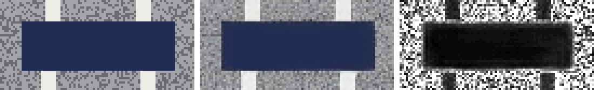

# 拆解“抠图”：生成模型与分割模型为什么给出不同的结果

> 语言：**中文** · 日本語（翻译中） · English（翻译中）
> 所属：[技术原理](README.md) · 更新：2026-09-16 · 实验代码：[labs/latent-roundtrip](../../tech-notes/labs/latent-roundtrip/)

Hackathon demo 里有一个 `garment_extract` 任务：用户上传一张衣服照片，后端把照片交给 Gemini 的生图模型，让它“去掉背景，只保留衣服，放在白底上”。返回的图片看起来很干净，演示效果也不错。

《技术选型》却决定在 v2 里换掉这一步，改用 BiRefNet 这类分割模型来抠图。两种做法最后都得到“白底上的一件衣服”，为什么要换？

要回答这个问题，就不能只看结果图，而要看两类模型各自**输出的是什么**。本文先从分割模型开始，看它怎样决定哪些像素属于衣服；再看生成模型怎样“抠图”，并用一个实验测量：图片只是在潜空间里走一个来回，衣服的像素会发生多大变化。最后回到 StyleAI 的入库流程，说明两类模型各自放在哪一步。

你已经了解扩散模型的基本原理，本文不再介绍去噪过程本身，只补充和本文结论直接相关的部分。

## 两个模型，两种输出

先把结论放在最前面，后面逐步验证：

```text
分割模型：输入照片 ──► 每个像素“是不是衣服”的判断（mask）
                              │
                              ▼
                  抠图结果 = 原照片的像素 × mask

生成模型：输入照片 + 指令 ──► 一张新生成的图片
                              │
                              ▼
                  抠图结果 = 模型画出来的像素
```

**分割模型不产生新的颜色，它只做选择；生成模型的输出里，每个像素都是重新画出来的。** 这一点决定了后面的所有差别。

## 分割模型：给每个像素一个判断

### 从“这张图里有什么”到“这个像素属于什么”

图像分类回答的是“这张图里有没有衣服”，整张图一个答案。分割要回答的是“**每一个像素**属于什么”，一张 1080×1440 的照片，就要给出一百五十多万个答案。

按照要回答的问题不同，分割有几种常见形式：

| 形式 | 回答的问题 | 输出 | 例子 |
| --- | --- | --- | --- |
| 前景/背景二分 | 这个像素是不是主体 | 一张前景概率图 | 商品图去背景 |
| 语义分割 | 这个像素属于哪一类 | 每个像素一个类别编号 | 区分上衣、裤子、皮肤、头发 |
| 实例分割 | 这个像素属于哪一个物体 | 每个物体一张 mask | 区分照片里的两件外套 |

StyleAI 的衣橱入库面对的主要是第一种：用户拍的是一件衣服，我们要把它和背景分开。BiRefNet 解决的正是这类问题，它的论文把任务称为“高分辨率二分图像分割”（dichotomous image segmentation），“二分”就是前景和背景两类。

### 模型内部做了什么

在本文的范围内，可以把一个分割模型拆成两段：

```text
照片 (H × W × 3)
   │
   ▼
编码器：逐层缩小尺寸、提取特征
   │   浅层：边缘、纹理
   │   深层：“这是一件衣服”的整体语义
   ▼
解码器：逐层放大回原尺寸，把深层语义和浅层细节结合起来
   │
   ▼
前景概率图 (H × W)，每个像素一个 0～1 之间的值
```

编码器负责“认出主体在哪里”，解码器负责“把边界画准”。难点在第二步：深层特征的分辨率很低，直接放大，边缘就会糊成一片。

BiRefNet 在这里做了两件事来补回细节。它的编码器使用 Swin Transformer，解码器分成先定位、后重建两个阶段；在重建阶段，它把原图的高分辨率局部切块作为额外输入送进解码器，让模型在画边界时能直接参考原图细节，论文称之为“向内参考”；同时用图像的梯度图作为辅助监督，引导模型关注边缘和细节密集的区域，称为“向外参考”。

这些设计的效果体现在输出上：它适合处理毛边、镂空、细带子这类边界复杂的物体，而衣服恰好常有这些细节。

### 从概率图到抠图结果

模型输出的是概率图，还不是抠好的图。接下来有两种用法：

- **二值 mask**：设一个阈值（比如 0.5），大于阈值的像素算衣服，其余算背景。边缘是硬的。
- **alpha matte**：直接把概率当作透明度。边缘的像素可以是半透明的，适合毛衣的绒毛、蕾丝、网纱。

无论哪种，最后一步都是同一个操作：**用 mask 从原照片里取像素**。取出来的像素值和原照片完全一样，只是被标记为保留或透明。

我们用实验确认这一点。实验的输入是一件程序生成的灰色卫衣：它有像素级的麻灰纹理、两根米白色抽绳和一块藏青色胸标，已知哪些像素属于衣服。实验 [A] 把衣服放在白底上作为“照片”，再按 mask 取回衣服像素，与原始像素逐个比较：

```text
[A] mask-based cutout vs original garment pixels
  mean abs diff per channel : 0.00 / 255
  max abs diff              : 0 / 255
  pixels changed at all     : 0.0%
  pixels changed by > 10    : 0.0%
  PSNR                      : inf dB
```

十二万多个衣服像素，差异全部为 0。这里的 mask 是已知的，所以实验只验证“按 mask 取像素”这一步。真实的分割模型可能把 mask 画错，但错误的表现形式是固定的：**边缘多了一点背景，或者少了一块衣服**。衣服内部被保留下来的像素，不会因为模型而改变。

这种错误是“看得见”的。把抠图结果叠在棋盘格背景上，缺了哪块、多了哪块一眼就能看出来，也可以用 mask 的面积、形状做自动检查。

## 生成模型：每个像素都是画出来的

### 输入照片只是一个条件

让生图模型“去掉背景”时，我们交给它的是一张照片和一句指令。在扩散模型的框架里，这两者都是**条件**：模型从噪声出发，一步步去噪，生成一张符合条件的新图片。

训练让模型学会了“符合指令、和参考图高度相似”的图片长什么样，所以输出通常很像原图。但在这个过程里，并不存在一个“把原图像素复制过来”的操作。像不像，取决于模型画得有多准。

### 潜空间：先压缩，再画回来

现在主流的图像生成模型大多不直接在像素上去噪，而是先用一个自编码器（VAE）把图片压缩成尺寸小得多的**潜变量**（latent），在潜空间里完成去噪，最后再用解码器画回像素：

```text
照片像素 ──编码器──► 潜变量 ──去噪、按条件修改──► 新的潜变量 ──解码器──► 输出像素
```

这个结构带来一个很容易被忽略的事实：**即使去噪过程完全不改动潜变量，图片从像素到潜空间再回到像素，这一趟往返本身就会改变像素。**

我们用实验测一下这一趟往返的影响有多大。实验 [B] 使用公开的 Stable Diffusion VAE（`stabilityai/sd-vae-ft-mse`），把同一件卫衣编码成潜变量，再直接解码回来。**不去噪，不加任何提示词**，只做编码和解码：

```text
image tensor (1, 3, 560, 480) -> latent (1, 4, 70, 60)
  values in image / values in latent = 48x
```

560×480 的图片被压缩成 4 个通道、70×60 的潜变量。宽高各缩小到 1/8，数值总量只剩原来的 1/48。解码器要用这 1/48 的信息，把十几万个像素重新画出来。

画回来的衣服像素和原图比较：

```text
[B] VAE encode -> decode vs original garment pixels
  mean abs diff per channel : 25.07 / 255
  max abs diff              : 135 / 255
  pixels changed at all     : 99.8%
  pixels changed by > 10    : 73.8%
  PSNR                      : 18.3 dB
```

99.8% 的像素都变了，四分之三的像素变化超过 10 个色阶。和实验 [A] 的“全部为 0”相比，这是完全不同的结果。

但如果把两张图放在一起看，它们非常像。差异到底在哪里？我们把两张图做同样程度的模糊，去掉像素级的细节，只比较“整体颜色”，同时统计衣服的平均颜色和像素的标准差（标准差越大，纹理的明暗起伏越强）：

```text
[B-lowfreq] round trip after blurring both images (sigma=3), interior pixels
  mean abs diff per channel : 1.56 / 255
  max abs diff              : 8 / 255
  pixels changed by > 10    : 0.0%
  PSNR                      : 42.2 dB
  garment mean color  original #8D8E92  decoded #8F8F93
  pixel std-dev (texture)  original 31.0  decoded 24.4
```

模糊之后，差异降到平均 1.56 个色阶，平均颜色从 `#8D8E92` 变成 `#8F8F93`，几乎一样。纹理的标准差却从 31.0 降到 24.4。

也就是说，**往返基本保住了整体颜色和形状，被重新画过的是细节**：麻灰面料里一根根深浅不同的纤维，被画成了另一种更平滑的颗粒。胸标区域的放大对比更直观：



左边是原图，中间是往返后的结果，右边是差异放大 8 倍后的图。胸标内部是均匀的藏青色，差异很小，几乎是黑的；胸标的边缘和抽绳的边缘出现了一圈灰色的差异；麻灰纹理处处都是亮点，说明纹理的每个像素都被重新画过。

```text
[B-logo] same round trip, logo area only
  mean abs diff per channel : 14.47 / 255
  pixels changed by > 10    : 45.2%
```

需要说明实验的边界：Google 没有公开 Gemini 图像模型的内部结构，这个实验用的是另一个公开模型，不是在复现 Gemini。它说明的是这一类处理的共同性质：**输出的像素由模型解码生成，而不是从原图复制。** Gemini 的文档也写明，所有生成的图片都嵌入了 SynthID 水印，这本身就要求输出像素经过模型改写。

### 去噪过程还会“补全”和“修正”

实验只做了编码和解码。真正的生图编辑还要在潜空间里去噪，这一步的目标是生成**合理**的图片，于是模型会主动做一些我们没有要求的事：

- 把皱巴巴平铺在床上的衣服“整理”平整；
- 画出照片里被折住、被遮挡的袖子或下摆；
- 把看不清的小字、复杂印花画成“看起来像”的样子；
- 同一张输入运行两次，得到两张不完全相同的结果。

对展示用的图片，这些行为有时是优点。可衣橱入库要的是“这件衣服本来的样子”，它们就都成了误差。Demo 的试穿提示词里专门写了“图案、文字、Logo 与参考图像素级一致，严禁臆造花纹”，还列出了失败后必须重做的条件，说明团队在试穿环节已经遇到过这类问题。**提示词可以降低偏差出现的概率，但无法把“画出来”变成“复制过来”。**

## 两类模型在入库环节的对比

| | 分割模型（如 BiRefNet） | 生成模型（如 Gemini 图像模型） |
| --- | --- | --- |
| 输出 | 每个像素的前景概率 | 一张新图片 |
| 衣服内部的像素 | 与原照片完全一致 | 由模型重新画出，细节会变化 |
| 出错时的表现 | 边缘多了背景、少了局部，一眼可见 | 纹理、印花、文字悄悄改变，不易察觉 |
| 能否自动检查 | 可以检查 mask 面积、形状、是否贴边 | 需要把输出和原图对比，本身就很难 |
| 同一输入重复运行 | 结果相同 | 通常不同 |
| 皱褶、遮挡、缺失的部分 | 保持原样，无法修复 | 可以整理、补全 |
| 运行方式 | 一次前向推理，可以自己部署 | 调用云端生成服务 |

## StyleAI 怎样使用这两类模型

两类模型没有好坏之分，关键是**用在要求相符的地方**。

**入库时，用分割模型得到“真值图”。** 用户上传的照片经过分割得到的抠图，是这件衣服在系统里的唯一真值。颜色提取（见[《衣服的颜色怎样变成数据》](02-garment-color-extraction.md)）、属性打标、生图时的服装参考，全都以它为输入。

**生成模型用在“需要新像素”的地方。** 把多件衣服穿到模特身上，本来就是要创造一张不存在的图片，这正是生成模型的用途。如果将来需要更好看的平铺展示图，也可以用生成模型另外做一张，但它只是派生出来的展示图，不会覆盖真值图。

**用真值图检查生成结果。** 效果图生成后，`render_critique` 会把效果图里的服装和真值图对比：颜色是否一致、印花和 Logo 是否保留。生成模型可能出现的偏差，就在这一步被发现。

入库流程因此是：

```text
用户上传照片
   │
   ├─ 校正方向、统一尺寸
   ├─ 分割模型 → alpha matte
   ├─ 质量检查：主体面积占比、是否贴边被裁、是否多个主体
   │     └─ 不通过 → 提示用户重拍（平铺或挂拍、正面、背景简单）
   ├─ 保存原图 + 抠图（真值图）
   ├─ 颜色提取 → 主色、辅色、点缀色
   └─ 视觉模型打标 → 类目、材质、廓形、玩法潜力……
```

分割模型也有它做不到的事，需要在产品上配合：

- **穿在身上的衣服**：前景/背景二分会把人和衣服一起抠出来。这时需要能区分上衣、裤子、皮肤的语义分割模型（服装解析），M1 评估是否支持这类照片；首个版本优先引导用户上传平铺或挂拍照片。
- **衣架、夹子等道具**：它们和衣服一起属于前景，需要在质量检查中识别，或提示用户去掉。
- **模型许可**：不同分割模型的许可条款不同。例如 rembg 项目的说明中提到，其默认的 BRIA RMBG 模型需要单独的商业授权。M1 选型时，许可条款和效果一起评估。

## 小结

回到开头的问题：两种方法都能得到“白底上的一件衣服”，但分割模型给出的是原照片的像素，生成模型给出的是它重新画出的像素。实验中，仅仅一次潜空间往返，就改写了 99.8% 的衣服像素：整体颜色基本保持，纹理和边缘被重新画过。

StyleAI 需要一张可以信任的真值图，作为颜色提取、打标和效果图检查的基准，所以入库用分割模型；把衣服穿到模特身上、创造新画面的工作，才交给生成模型。

读完本文，可以试着回答：如果用户上传的是一件印着小字的 T 恤，生成的效果图里小字写错了，StyleAI 的哪个环节能发现？它需要依赖哪张图片？

## 参考资料

- [BiRefNet 论文：Bilateral Reference for High-Resolution Dichotomous Image Segmentation](https://arxiv.org/abs/2401.03407)
- [BiRefNet 源码与模型](https://github.com/ZhengPeng7/BiRefNet)
- [rembg：背景移除工具与可用模型列表](https://github.com/danielgatis/rembg)
- [Latent Diffusion 论文：High-Resolution Image Synthesis with Latent Diffusion Models](https://arxiv.org/abs/2112.10752)
- [Hugging Face：stabilityai/sd-vae-ft-mse](https://huggingface.co/stabilityai/sd-vae-ft-mse)
- [FLUX.1 Kontext 论文：Flow Matching for In-Context Image Generation and Editing in Latent Space](https://arxiv.org/abs/2506.15742)
- [Gemini API：图像生成（Nano Banana 系列模型）](https://ai.google.dev/gemini-api/docs/image-generation)
- [Segment Anything 2 论文](https://arxiv.org/abs/2408.00714)
