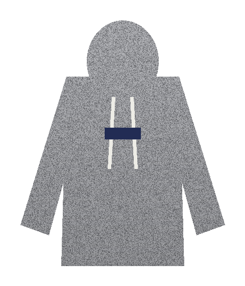

# 衣服的颜色怎样变成数据

> 语言：中文（摸索阶段只维护中文版）
> 所属：[技术原理](README.md) · 更新：2026-09-16 · 实验代码：[labs/garment-palette](../../tech-notes/labs/garment-palette/)

StyleAI 给每件入库的衣服打一张标签，其中颜色一栏是这样的：

```text
颜色：麻灰 #8D8E92 100% · 点缀：米白 #EDECE6、藏青 #222C54
```

让视觉模型看一眼照片，它也能说出“灰色卫衣，白色抽绳，深蓝色胸标”。为什么还要用算法去算 hex 值和占比？

因为搭配规则需要的是数字。“同色系深浅叠穿”要比较几件衣服的明度差；“中性色打底、一个亮色点缀”要判断哪件衣服是中性色；效果图生成后，还要检查模特身上的颜色和原衣服差了多少。“灰色”“深蓝色”这样的词，做不了这些比较。

本文沿着一件卫衣的颜色提取过程，一步步回答：该统计哪些像素，为什么不直接用 RGB 比较颜色，怎样找出主要的几种颜色，麻灰这种由深浅纤维混出来的颜色为什么会被算错，以及小面积的点缀色怎样找回来。

实验用程序画出一件灰色卫衣：像素级随机混合的深浅两种灰（模拟麻灰面料），从上到下逐渐变暗的光影，两根米白色抽绳，一块藏青色胸标。用程序生成，是为了让每一步的“正确答案”已知，结果也可以完整复现。实验代码见 [extract_palette.py](../../tech-notes/labs/garment-palette/extract_palette.py)，下文输出来自实际运行。



## 先确定统计哪些像素

最简单的想法是：把所有像素的颜色取平均。我们分别对“白底上的整张照片”和“只包含衣服的抠图”计算：

```text
image 480x560, garment pixels 122027 (45.4% of image)

[1] mean color
  whole photo on white background : #CBCCCE
  garment pixels only (cutout)    : #8D8E92
```

衣服只占画面的 45.4%，剩下一半多是白色背景。整张照片的平均色 `#CBCCCE` 是一种很浅的灰，被背景拉亮了一大截；只统计衣服像素，才得到 `#8D8E92`。

**颜色提取的第一步，是只统计属于衣服的像素。** 这正是上一篇文章中入库要先做分割、并以抠图作为真值图的原因之一。

但即使只看衣服，平均值也不是好答案。平均会把抽绳的米白、胸标的藏青，和大面积的灰混成一个数，而“一件带藏青胸标的灰卫衣”包含的信息，一个平均色表达不出来。我们需要的是**几种颜色，以及各自的占比**。

## RGB 为什么不适合比较颜色

要把像素分成几组颜色，就得先定义“两个颜色有多接近”。像素是用 RGB 存储的，直觉上可以把 (R, G, B) 当作三维坐标，算欧氏距离。

问题是，RGB 距离和人眼感受到的差别并不成比例。下面几组颜色，我们同时计算 RGB 欧氏距离和 CIEDE2000 色差（ΔE00，一种按人眼感知设计的色差公式，稍后介绍）：

```text
[0] RGB distance vs CIEDE2000
  #202020 vs #404040  RGB distance  55.4  dE00  10.2   two dark greys
  #D0D0D0 vs #F0F0F0  RGB distance  55.4  dE00   7.1   two light greys
  #1E3A8A vs #1E3AAA  RGB distance  32.0  dE00   4.9   two blues
  #808080 vs #80A080  RGB distance  32.0  dE00  19.4   grey vs grey-green
```

前两行的 RGB 距离完全相同，人眼感受到的差别却不一样；后两行 RGB 距离也相同，“灰变成灰绿”的色差是“蓝色深浅变化”的将近四倍。

原因有两层。第一，sRGB 的数值和实际亮度之间不是线性关系，它经过了伽马编码。第二，人眼对不同颜色方向的敏感程度不同，对“有没有颜色”（灰色偏向某个色相）尤其敏感。

### CIELAB：按人眼感知排布的颜色坐标

为此，国际照明委员会（CIE）定义了 CIELAB 颜色空间。每个颜色用三个数表示：

| 分量 | 含义 | 范围 |
| --- | --- | --- |
| L* | 明度，0 为黑，100 为白 | 0～100 |
| a* | 绿（负）到红（正） | 约 -128～127 |
| b* | 蓝（负）到黄（正） | 约 -128～127 |

它的设计目标是：坐标上距离相同的两对颜色，人眼感觉的差别也大致相同。从 a*、b* 还可以换算出两个对搭配很有用的量：

```text
彩度 C* = √(a*² + b*²)        离灰轴有多远，0 就是纯灰
色相角 h = atan2(b*, a*)       在色相环上的角度
```

本文最后提取出的三种颜色，换算成 CIELAB 是这样的（输出中的 `[7]` 是实验脚本的最后一步，这里提前引用）：

```text
[7] CIELAB and LCh of the extracted colors
  #8D8E92  L*= 59.1  a*=  0.4  b*=  -2.2  C*=  2.3  h=281
  #EDECE6  L*= 93.3  a*= -0.7  b*=   3.0  C*=  3.1  h=103
  #222C54  L*= 19.1  a*=  9.3  b*= -25.7  C*= 27.4  h=290
```

麻灰 `#8D8E92` 和米白 `#EDECE6` 的彩度都只有 2～3，属于中性色；两者的差别主要在明度（59.1 与 93.3）。藏青 `#222C54` 的彩度是 27.4，是这件衣服上唯一“有颜色”的部分。这些数字，正是后面判断“中性色打底、一个深色点缀”的依据。

CIELAB 里的欧氏距离仍然不够准确，尤其是在蓝色区域和高彩度区域。CIEDE2000 在 CIELAB 的基础上，对明度、彩度、色相的差别分别加权修正，是目前常用的色差公式。实际使用时，可以大致这样理解它的数值：ΔE00 小于 1，人眼几乎分辨不出；2～10，并排对比时能看出差别；再往上，就是明显不同的颜色。

> 较新的 OKLab 颜色空间也以感知均匀为目标，计算更简单。StyleAI 选用 CIELAB 与 CIEDE2000，是因为它们是色彩管理与纺织行业长期使用的标准，工具库支持完善。

## 用 k-means 找出主要颜色

有了颜色空间和距离，就可以把衣服的十几万个像素分成几组。StyleAI 使用最常见的聚类算法 k-means。它的过程很直接：

```text
1. 决定要分成 k 组，挑出 k 个初始中心
2. 把每个像素分给离它最近的中心
3. 用每组像素的平均值，作为这一组新的中心
4. 重复 2、3，直到中心不再移动
```

初始中心的选法会影响结果。实验使用 k-means++：先随机挑一个像素作为第一个中心，之后每次挑选时，离已有中心越远的像素，被选中的概率越大。这样初始中心会分散开，不容易让两个中心挤在同一种颜色里。

为了速度，实验先随机抽取 2 万个像素计算中心，再把全部像素分配到最近的中心，统计每组的占比。

取 k=5，分别在 RGB 和 CIELAB 中聚类：

```text
[2] k-means in RGB, raw pixels, k=5
  #9C9DA0   36.0%
  #696A6D   33.9%
  #A7A8AC   27.5%
  #EDECE6    1.4%
  #222C54    1.3%

[3] k-means in CIELAB, raw pixels, k=5
  #9C9DA0   36.0%
  #696A6D   33.9%
  #A7A8AC   27.5%
  #EDECE6    1.4%
  #222C54    1.3%
  CIEDE2000 between the two largest clusters: 19.1
```

两个颜色空间给出的结果完全一样。这并不矛盾：这件衣服几乎全是灰色，灰色的 a*、b* 都接近 0，颜色之间只在明度上有差别；无论在 RGB 还是 CIELAB 中，灰色都排在一条直线上，远近顺序相同，分组也就相同。**两种颜色空间的差别，出现在有彩色的衣服上。** StyleAI 仍然在 CIELAB 中计算，因为下一步合并颜色时要用 ΔE00 设定阈值，而这个阈值只有在感知均匀的空间里才有意义。

抽绳的米白 `#EDECE6` 和胸标的藏青 `#222C54` 都被准确地分了出来。但前三组的结果有问题。

## 麻灰：像素看到的和人眼看到的不一样

照着 `[3]` 的输出给这件衣服打标签，结果会是“中灰 36%、深灰 34%、浅灰 28%”。两个最大分组之间的色差是 19.1，确实是明显不同的两种灰。

可我们看这件卫衣，只会说它是**一件**麻灰色的卫衣。

问题出在观察的尺度上。麻灰面料由深浅不同的纤维混纺而成，实验里模拟为像素级随机混合的两种灰。k-means 逐个像素地看，看到的是一深一浅两种颜色；人站在一两米外看衣服，眼睛会把相邻的细小颜色混在一起，看到的是它们混合后的中间色。

所以在聚类之前，我们先对图像做一次模糊，模拟“从正常距离看”的效果。模糊有一个细节要处理：衣服边缘的像素，如果和透明背景一起模糊，会把背景的颜色混进来。实验采用**带遮罩的模糊**：只让衣服像素参与模糊，再除以同样模糊过的遮罩，把边缘处的权重补回来。

模糊（sigma=3）之后再聚类：

```text
[4a] k-means in CIELAB after masked blur, k=5
  #89898D   56.2%
  #949599   40.2%
  #30385C    1.3%
  #CCCCCA    1.2%
  #AEAFB0    1.1%
```

深浅纤维混合的问题解决了，但灰色仍然分成了两组：56.2% 和 40.2%，颜色也很接近。这次的原因不是面料，而是光影：衣服从上到下逐渐变暗，上半身和下半身被分到了两组。

两组灰色属于同一种面料，应该合并。我们计算各组中心之间的 ΔE00，把差值小于 10 的组两两合并，合并后的中心按占比加权平均：

```text
[4b] merged by CIEDE2000 < 10
  #8D8E92   96.4%
  #BEBEBD    2.3%
  #30385C    1.3%
```

两组灰色合并成了 `#8D8E92`，占 96.4%。剩下两组值得仔细看：

- `#BEBEBD`（2.3%）：一种浅灰。原图里并没有这种颜色，它是米白抽绳被模糊后和周围的灰色混出来的**过渡色**。
- `#30385C`（1.3%）：比原来的藏青 `#222C54` 浅，同样是胸标被模糊后和灰色混合的结果。

模糊帮我们得到了正确的主色，也同时制造了这些不存在的中间色。所以主色要设一个占比门槛，只保留覆盖了衣服相当面积的颜色。实验取 10%：

```text
[4c] dominant colors: merged clusters with share >= 10% (share renormalized)
  #8D8E92  100.0%
```

这件卫衣的主色是 `#8D8E92`。它和第一步“只统计衣服像素的平均色”恰好相同，因为这件衣服本来就只有一种主色；如果是一件两色拼接的外套，平均色会是两种颜色的混合，而这里的流程会得到两个主色。

## 点缀色：模糊之后被抹掉的细节

主色找对了，但抽绳和胸标也被一起丢掉了。对搭配来说，它们恰恰是重要的信息：藏青胸标意味着这件卫衣和藏青色的下装或帽子能产生呼应。

模糊是为了主色而做的，点缀色要回到**没有模糊的原始像素**里找。条件是：面积不需要大，但颜色要和所有主色明显不同。实验在原始像素上取 k=8 聚类，把占比至少 0.5%、且与每个主色的 ΔE00 都不小于 20 的分组标记为点缀色：

```text
[6] accents: raw CIELAB clusters (k=8) with share >= 0.5% and dE00 >= 20 from every dominant color
         #A2A3A7   19.4%  nearest dominant dE00   6.6
         #65666A   18.6%  nearest dominant dE00  15.8
         #AAABAF   17.4%  nearest dominant dE00   8.9
         #9C9DA1   17.0%  nearest dominant dE00   4.8
         #6D6E72   15.2%  nearest dominant dE00  12.5
         #98999C    9.6%  nearest dominant dE00   3.4
  ACCENT #EDECE6    1.4%  nearest dominant dE00  25.2  -> off-white / 米白 / オフホワイト (dE00 1.0)
  ACCENT #222C54    1.3%  nearest dominant dE00  38.1  -> navy / 藏青 / ネイビー (dE00 0.9)
```

六组灰色和主色的距离都在 16 以内，它们是同一块面料的深浅纤维和光影，不算点缀。米白抽绳（25.2）和藏青胸标（38.1）距离主色足够远，被找了回来，而且颜色是原始像素的颜色，没有被模糊冲淡。

**主色从模糊后的图像里找，看的是整体；点缀色从原始像素里找，看的是细节。** 两步各自回答一个问题，合起来才是完整的配色信息。

阈值 20 和 10%、0.5% 这几个数，是针对这个实验选的。M1 会用 200 件真实衣服的标注集校准。

## 给颜色起名字

hex 值是给程序用的，标签上还需要人能读懂的名字。`[5]` 和 `[6]` 中的名字，来自一张三语的参考色表：计算颜色与表中每个参考色的 ΔE00，取最近的一个。

```text
[5] naming against the reference table
  #8D8E92  100.0%  -> heather grey / 麻灰 / 杢グレー  (dE00 2.9)
```

名字后面的 ΔE00 表示与参考色的距离。距离很小，说明这个名字很贴切；距离很大，说明参考表里没有合适的名字。

参考表不可能覆盖所有时尚用语，比如“くすみブルー”（灰调蓝）、“モカ”（摩卡色）这类会随流行变化的叫法。所以 StyleAI 的分工是：**算法负责数值，数值是唯一的真值；视觉模型参考数值和图片，给出更自然的名称。** 名称可以改，数值不随名称变化。

## 最终保存的数据

一件衣服的颜色，最终以这样的结构保存在 `garments` 表的颜色字段中：

```json
{
  "dominant": [
    { "hex": "#8D8E92", "lab": [59.1, 0.4, -2.2], "share": 1.0, "name": { "zh": "麻灰", "ja": "杢グレー", "en": "heather grey" } }
  ],
  "accents": [
    { "hex": "#EDECE6", "lab": [93.3, -0.7, 3.0], "share": 0.014, "name": { "zh": "米白", "ja": "オフホワイト", "en": "off-white" } },
    { "hex": "#222C54", "lab": [19.1, 9.3, -25.7], "share": 0.013, "name": { "zh": "藏青", "ja": "ネイビー", "en": "navy" } }
  ],
  "method": "masked-blur-kmeans-lab/v1"
}
```

同时保存 hex 和 CIELAB 值，前者用于显示，后者用于计算。`method` 记录提取方法的版本；将来改进算法后，可以知道哪些衣服需要重新计算。

## 这些数字怎样用在搭配里

把 `[7]` 中的数值和搭配规则对应起来：

```text
[7] CIELAB and LCh of the extracted colors
  #8D8E92  L*= 59.1  a*=  0.4  b*=  -2.2  C*=  2.3  h=281
  #EDECE6  L*= 93.3  a*= -0.7  b*=   3.0  C*=  3.1  h=103
  #222C54  L*= 19.1  a*=  9.3  b*= -25.7  C*= 27.4  h=290
```

| 搭配判断 | 用到的数值 | 在这件卫衣上 |
| --- | --- | --- |
| 是不是中性色 | 彩度 C* 很低 | 主色 C*=2.3，是中性色，适合作为打底 |
| 明暗对比强不强 | 明度 L* 的差 | 藏青点缀 L*=19.1，与主色相差 40，对比明显 |
| 能否做同色系深浅叠穿 | 色相 h 接近、L* 分出层次 | 需要和其他衣服的数值一起比较 |
| 效果图颜色是否还原 | 效果图中服装区域与真值图的 ΔE00 | M3 设定阈值 |

`validate_outfit` 工具就是用这些数值检查候选方案的配色，Agent 再结合技巧卡解释“为什么这样配好看”。具体阈值在知识库 v1 中和技巧卡一起确定。

## 算法管不到的部分：光线与相机

最后要说明这套方法的边界。算法只能忠实地统计照片里的像素，而照片里的颜色已经受到了拍摄条件的影响：暖黄色的室内灯光会让白衬衫偏黄，手机的自动白平衡和滤镜会改变整体色调。

这类偏差无法在像素层面可靠地消除，StyleAI 用产品流程来控制：上传时提示在自然光下拍摄；允许用户修正颜色标签，修正结果进入评测数据；M1 用同一批衣服在不同光线下拍摄，测量提取结果的波动范围。

## 小结

一件衣服的颜色，从像素变成数据，经过了这样几步：只统计衣服像素，在 CIELAB 中用 ΔE00 衡量差别，模糊后聚类得到主色，合并同一面料的深浅，按占比过滤掉模糊产生的过渡色，再回到原始像素中找回点缀色，最后给数值配上名字。

每一步都在回答一个具体的问题。麻灰的例子说明，“像素上的颜色”和“人眼看到的颜色”并不相同，算法要先确定自己在模拟哪一种观察。

读完本文，可以试着回答：一件红白条纹的衬衫，条纹宽度只有几毫米，按本文的流程会得到什么主色？这个结果对搭配有用吗？流程需要怎样调整？

## 参考资料

- [CIE：色度学与 CIELAB 颜色空间](https://cie.co.at/publications/colorimetry-part-4-cie-1976-lab-colour-space-0)
- [Sharma 等：CIEDE2000 色差公式的实现说明与测试数据](https://hajim.rochester.edu/ece/sites/gsharma/ciede2000/)
- [scikit-image：颜色空间转换与色差函数](https://scikit-image.org/docs/stable/api/skimage.color.html)
- [Björn Ottosson：OKLab 颜色空间](https://bottosson.github.io/posts/oklab/)
- [Arthur 与 Vassilvitskii：k-means++（SODA 2007）](https://theory.stanford.edu/~sergei/papers/kMeansPP-soda.pdf)
- [sRGB 与伽马编码](https://en.wikipedia.org/wiki/SRGB)
