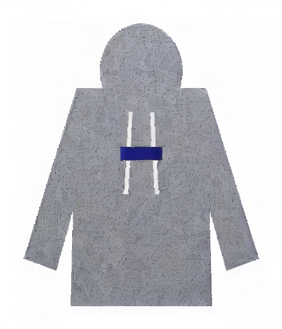

# 多阶段生图的一致性：参考图、漂移与锚点

> 语言：中文（摸索阶段只维护中文版）
> 所属：[技术原理](README.md) · 更新：2026-09-16 · 前置阅读：[01 拆解“抠图”](01-generation-vs-segmentation.md) · 实验代码：[labs/latent-roundtrip](../../tech-notes/labs/latent-roundtrip/)

StyleAI 的复杂方案分阶段生成：

```text
阶段 1  模特参考图 + 白 T + 牛仔裤          → 基础造型
阶段 2  阶段 1 的输出 + 卫衣真值图          → 卫衣绑在腰间
阶段 3  阶段 2 的输出 + 工装夹克真值图      → 加外套
阶段 4  阶段 3 的输出                      → 卷袖、塞衣角等细节
```

这样拆分的理由很实际：一次要求模型同时穿好四件衣服、还要把卫衣绑在腰上，失败率很高；拆成四步，每步只改一件事，成功率高得多，而且失败时能定位到具体阶段。

但[《拆解“抠图”》](01-generation-vs-segmentation.md)里的结论在这里会带来一个问题：**每一次生图都会重画整张图的像素。** 阶段 2 重画一遍，阶段 3 在重画过的图上再重画一遍……四个阶段下来，最初那条牛仔裤还是原来的颜色吗？模特还是同一个人吗？

本文先说明一致性具体指什么、参考图是怎样起作用的，再用实验测量误差在连续编辑中的累积，最后给出 StyleAI 的应对办法。

## 一致性指的是三件不同的事

| 层面 | 要求 | 失败的样子 |
| --- | --- | --- |
| 模特身份 | 每个阶段、每张效果图里都是同一个人 | 脸型、发型、肤色在阶段之间变化 |
| 服装保真 | 衣服和用户真值图一致：颜色、印花、版型、细节 | 麻灰变成纯灰，胸标图案变形，牛仔裤水洗纹路消失 |
| 画面一致 | 构图、画幅、光线、背景保持统一 | 阶段 3 的背景比阶段 1 暗，人物位置偏移 |

三者的应对方式不同：模特身份靠固定的参考图组，服装保真靠每个阶段重新提供真值图，画面一致靠固定的输出规格与提示词约束。

## 参考图是怎样起作用的

生图模型接受的输入不只有文字。把图片作为条件送进去，模型在生成时会参照它。Gemini 的图像模型把参考图分成几类角色，并对数量有上限，例如 Nano Banana 2 支持最多 10 张物体图、4 张人物图和 3 张风格图。

StyleAI 的用法与这几类角色对应：

| 角色 | 我们放什么 | 目的 |
| --- | --- | --- |
| 人物参考 | 选定模特的参考图组（正面、侧面、四分之三身） | 保持同一个人 |
| 物体参考 | 本阶段涉及单品的真值图 | 保持服装本身的颜色与细节 |
| 编辑基底 | 上一阶段的输出 | 保持已经穿好的部分不变 |

注意“编辑基底”和“物体参考”的区别：前者是**要修改的那张图**，后者是**要参照的素材**。两者都会影响输出，但作用不同。

## 为什么每一步都会重画

图像编辑模型有两种常见形态：

- **局部重绘（inpainting）**：给出一个 mask，只重新生成 mask 内的区域，mask 外的像素直接保留。
- **整图重绘**：把基底图和参考图一起作为条件，重新生成整张图。目前多数“按指令编辑图片”的模型属于这一类，例如公开了技术细节的 FLUX.1 Kontext，就是把文本和图像拼成一个序列，用流匹配的方式生成新图。

整图重绘的好处是可以处理“把卫衣绑到腰上”这种需要重新安排大片区域的要求，mask 很难事先画准。代价就是：**没被要求修改的地方，也被重新画了一遍。**

那么，被重画的部分会偏离多少？偏离会不会随着阶段增加而累积？下面用实验测量。

## 实验：连续重画六次

实验仍然使用[《拆解“抠图”》](01-generation-vs-segmentation.md)里的那件灰卫衣和公开的 VAE。这里只做编码与解码，不去噪、不加提示词——**这是每次生图都必然包含的那一步，可以看作误差的下限**。

两种方式各跑六遍：

- **chained（链式）**：第 N 次在第 N-1 次的输出上进行，模拟阶段之间的接力；
- **anchored（锚定）**：每次都从原图开始，模拟“每个阶段都重新提供真值图”。

```text
  mode      pass  meandiff   lowfreq   texture  mean       dE00
  original     0      0.00      0.00      31.0  #8D8E92    0.00
  chained      1     25.07      1.56      24.4  #8F8F93    0.61
  chained      2     24.35      1.85      21.8  #8F9093    0.72
  chained      3     24.22      2.18      20.6  #8F9094    0.87
  chained      4     24.26      2.54      20.1  #8F8F95    1.23
  chained      5     24.36      2.98      20.0  #8F8F96    1.84
  chained      6     24.53      3.55      20.2  #8E8F98    2.59
  anchored     1     25.07      1.56      24.4  #8F8F93    0.61
  anchored     3     25.07      1.56      24.4  #8F8F93    0.61
  anchored     6     25.07      1.56      24.4  #8F8F93    0.61
```

各列的含义：`meandiff` 是与原图的平均像素差；`lowfreq` 是两张图都模糊之后的差，代表整体颜色与明暗的偏离；`texture` 是像素标准差，越小表示纹理越平；`dE00` 是平均颜色与原图的 CIEDE2000 色差。

先看 anchored 三行：**完全相同**。每次都从原图出发，误差就是单次重画的误差，不会增加。

再看 chained：

- `meandiff` 几乎不变（24～25）。单看这个数字会以为“没有变得更糟”，因为它被像素级的纹理噪声主导了。
- `lowfreq` 从 1.56 涨到 3.55，`dE00` 从 0.61 涨到 2.59。**整体颜色的偏离一路累加。**
- `texture` 从原图的 31.0 一路降到 20 左右。
- 平均颜色从 `#8D8E92` 漂到 `#8E8F98`，蓝色分量逐步升高。

数字之外，更值得看的是第 6 次的结果本身：



原图的麻灰是**随机的细小颗粒**，六次重画之后，这些颗粒不见了，取而代之的是一层弯曲、连续、有规律的纹路——**原图里根本没有这种图案**。抽绳变得模糊发虚，胸标的蓝色反而更浓了一些。

这比“纹理变平”更值得警惕：模型不只是丢掉了细节，还在丢掉细节的位置**补上了它认为合理的内容**。`texture` 那一列从 31 降到 20，掩盖了这个变化——像素的起伏确实变小了，但起伏的**性质**也变了。

回到[《衣服的颜色怎样变成数据》](02-garment-color-extraction.md)里的尺度：ΔE00 达到 2.59，已经进入“并排对比能看出差别”的范围。而如果这件衣服本来带有细小的印花或文字，这层被“补”出来的纹路就会直接改变它的图案。

**结论是：单次重画的偏差不大，但偏差的方向是一致的，所以在接力中会累加；而每次回到原图作参照，误差就不会增长。**

需要说明实验的边界：真实的生图模型在这一步之上还有去噪和按指令修改，偏差会更大、也更不规则；而模型厂商也在用参考图机制对抗漂移。实验给出的是趋势和机制，不是具体产品的数值。

## StyleAI 的应对

| 做法 | 说明 |
| --- | --- |
| **每个阶段都重新提供真值图** | 卫衣在阶段 2 加入，阶段 3、4 仍然把它的真值图作为物体参考。不依赖“上一阶段的图里已经有了” |
| **模特参考图每阶段都带上** | 保持同一张脸，不靠上一阶段的图传递身份 |
| **检查以真值图为准** | `render_critique` 把最终图与每件单品的真值图对比，而不是与上一阶段对比，避免“逐步偏离但每步看起来都没问题” |
| **出问题回到出错的阶段重做** | 不在已经跑偏的图上继续修补。阶段产物都保存在 `render_stages` 里，可以从任意阶段重来 |
| **限制阶段数** | 复杂方案最多 4 个阶段，单个任务最多 8 次图像调用 |
| **印花、Logo 明显的单品尽量安排在靠后的阶段** | 越早加入的元素被重画的次数越多，细节丢失的机会也越多 |
| **最终的小问题优先局部修复** | 例如只调整袖口，而不是整张重画 |

这些做法的共同点是：**把原始素材作为每一步的锚点，而不是让信息在阶段之间单向传递。**

## 阶段数的权衡

| 阶段数 | 单步成功率 | 累积漂移 | 成本与耗时 |
| --- | --- | --- | --- |
| 1（一次成图） | 低：复杂穿法容易失败 | 无 | 最低 |
| 2–4 | 高：每步只改一件事 | 可控，需要锚点 | 中等 |
| 5 以上 | 单步更容易，但整体失败率上升 | 明显 | 高 |

所以阶段拆分不是越细越好。M3 的评测要专门测一条曲线：**同一批方案，用不同的阶段数生成，比较服装还原度、非常规穿法完成度和成本**，据此确定上限。

## 评测里怎么体现

`render-fidelity-50` 评测集除了人工评分，还加入两个可以自动计算的指标：

| 指标 | 计算方式 |
| --- | --- |
| 服装色差 | 效果图中该单品区域的主色与真值图主色的 ΔE00 |
| 纹理保留 | 效果图中该单品区域的像素标准差与真值图的比值 |

这两个指标不能代替人工评分（它们看不出“绑腰有没有做到”），但能自动发现本文描述的漂移：一旦某次改动让色差普遍上升，报告里立刻可见。

## 小结

多阶段生图用“每步只改一件事”换取了复杂穿法的成功率，代价是每一步都会重画整张图。实验显示，链式接力时整体颜色的偏离会持续累加（ΔE00 从 0.61 涨到 2.59，纹理标准差从 31 降到 20），而每次回到原图作参照，误差保持不变。

因此 StyleAI 的规则很简单：**每个阶段都带上真值图和模特参考，检查始终对照真值图，出问题回到出错阶段重做。**

读完本文，可以试着回答：如果用户在效果图完成后说“把外套换成黑色的”，应该在最终图上直接改，还是回到某个阶段重做？这个决定和本文的哪个结论有关？

## 参考资料

- [Gemini API：图像生成与参考图角色](https://ai.google.dev/gemini-api/docs/image-generation)
- [FLUX.1 Kontext 论文：图文序列拼接与流匹配编辑](https://arxiv.org/abs/2506.15742)
- [Latent Diffusion 论文](https://arxiv.org/abs/2112.10752)
- [实验脚本：drift_lab.py](../../tech-notes/labs/latent-roundtrip/drift_lab.py)
